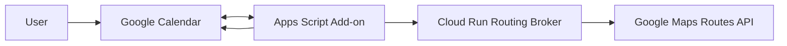
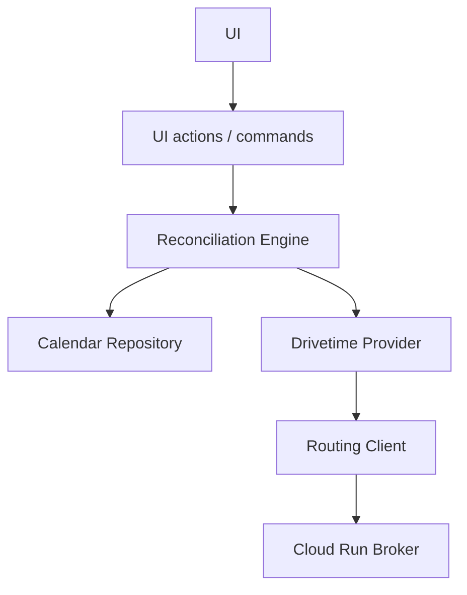
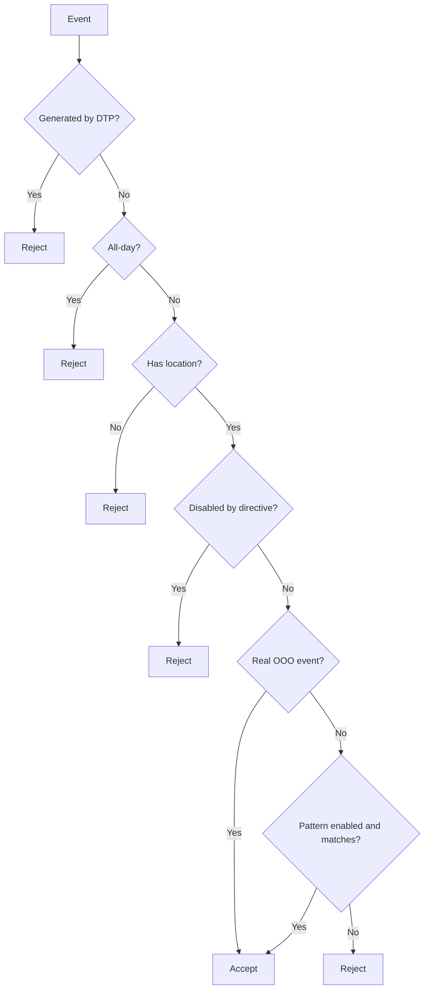
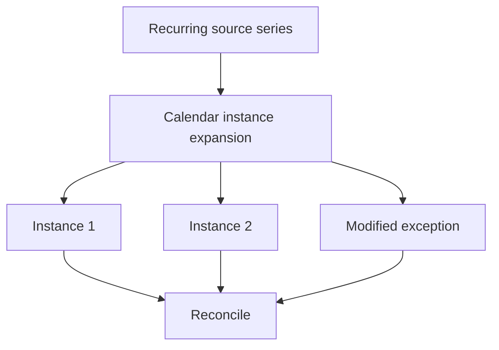
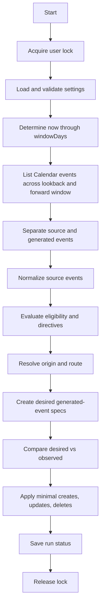
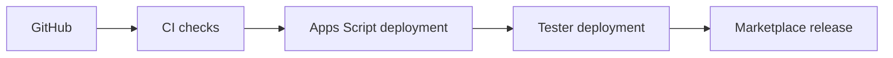
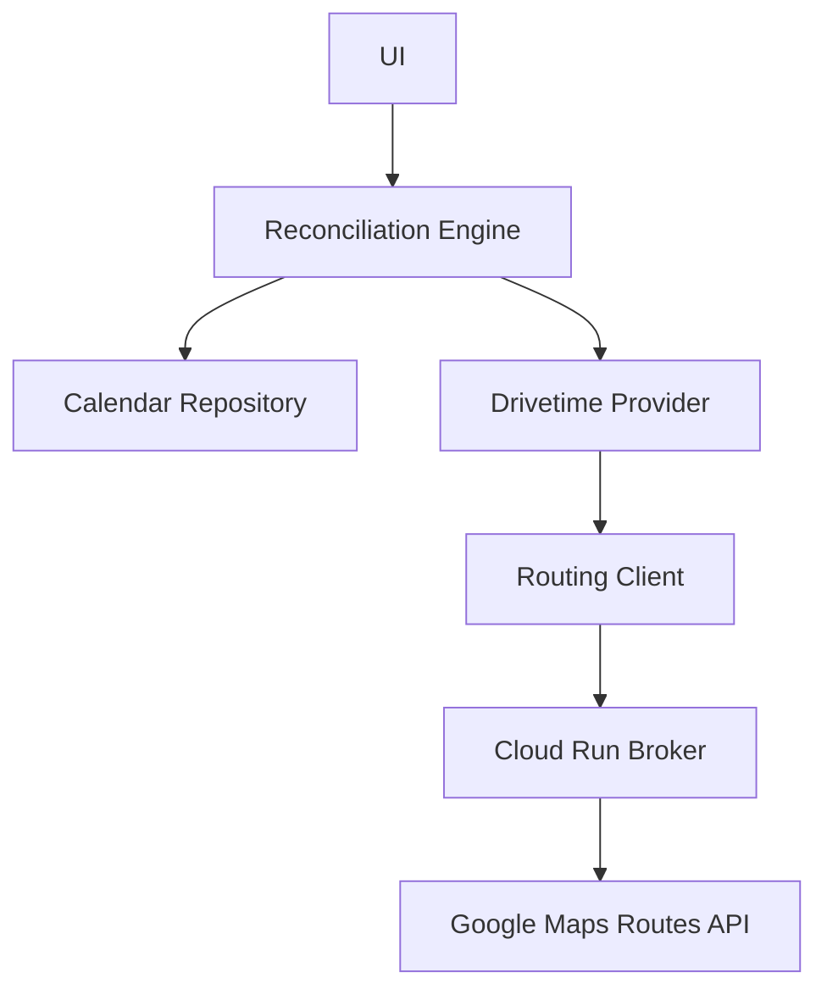

# Drivetime Padding Architecture

**Document version:** 1.0-draft  
**Project:** Drivetime Padding  
**Status:** Proposed implementation architecture  
**Primary runtime:** Google Apps Script  
**Distribution:** Google Workspace Marketplace  
**Routing backend:** Google Cloud Run + Google Maps Routes API

---

## 1. Executive Summary

Drivetime Padding is a Google Workspace Marketplace add-on that automatically creates and maintains travel-time events around eligible Google Calendar events.

The first supported use case is a timed Out of Office event representing an appointment away from the user's normal work location. When a qualifying event contains a destination in the Google Calendar `location` field, the add-on calculates the expected driving duration and creates two companion events:

1. an outbound travel event that ends when the source event begins; and
2. a return travel event that begins when the source event ends.

The generated events remain synchronized with the source event. If the source event is moved, resized, cancelled, deleted, or given a different location, the generated travel events are updated or removed. Recurring events are supported by expanding the series into concrete instances inside a rolling planning window and reconciling each instance independently.

The architecture is intentionally reconciliation-driven. The application does not try to infer which exact event caused a Calendar trigger. Instead, each synchronization run compares the state that should exist with the state that currently exists and applies the smallest safe set of changes.

Generated events are treated as disposable derived state. Google Calendar source events are authoritative. If generated events are deleted or corrupted, a later reconciliation recreates the correct state.

---

## 2. Product Goals

The product should solve one narrow problem extremely well:

> When a qualifying calendar event requires travel, automatically block the travel time before and after it.

The primary goals are:

- support ordinary consumer Google accounts;
- support Google Workspace accounts;
- distribute through Google Workspace Marketplace;
- require minimal infrastructure and operational work;
- create predictable, explainable results;
- support recurring events and recurring exceptions;
- preserve privacy by transmitting only route origin and destination to the routing backend;
- remain safe under retries, duplicate triggers, and partial failures;
- avoid unnecessary Calendar writes;
- keep the MVP small enough to implement and review confidently.

### 2.1 Non-goals for the MVP

The initial release does not attempt to support:

- arbitrary automation workflows;
- AI-based scheduling decisions;
- destination inference from event descriptions;
- attendee-address inference;
- Google Meet or conferencing-link inference;
- multiple calendars;
- shared organizational calendars;
- public transit, walking, or bicycling routes;
- continuous traffic-aware departure rescheduling;
- near-departure route refresh of any kind (see §21.3);
- routes longer than `MAX_TRAVEL_MINUTES`, currently six hours;
- billing, subscriptions, or premium plans;
- non-travel padding providers.

These are deferred rather than structurally prohibited.

---

## 3. Architectural Principles

### 3.1 Google Calendar is the source of truth

Only user-owned source events are authoritative.

Generated events may be deleted and recreated at any time. No external database is required to reconstruct the correct generated state.

### 3.2 Reconciliation over change processing

Calendar update triggers indicate that a calendar changed, but do not reliably identify the changed event. The application therefore does not implement a delta-processing model.

Each synchronization run answers:

> Given the current calendar and current settings, what generated events should exist?

This makes the system:

- idempotent;
- retry-safe;
- resilient to duplicate triggers;
- self-healing after partial failures;
- naturally compatible with recurring event exceptions.

### 3.3 Explicit input over inference

The system uses only explicit user-provided data:

- destination comes from the event `location` field;
- origin comes from configured origins, working-location state, or a per-event override;
- eligibility comes from real OOO event type or an optional user-configured subject pattern.

The system does not guess.

### 3.4 Generated events are derived cache entries

Generated events are best understood as a cache of deterministic calculations:

```text
source event
+ user settings
+ event directives
+ selected origin
+ route calculation
= desired generated events
```

This model simplifies recovery and removes the need for a persistent event-mapping database.

Route results are derived state under the same rule. A cached route duration is an optimization, never an authority:

```text
source event
    |
    v
route input hash
    |
    v
route plan cache  (may be discarded at any time)
    |
    v
generated events
```

The governing invariant is:

> Removing the route cache may increase broker calls, but must not change the final Calendar state.

### 3.5 Keep the architecture smaller than the problem domain

The system should remain extensible without becoming a generalized scheduling framework. The MVP uses one provider-like component for drivetime planning, but avoids extra abstractions that do not yet add practical value.

The final MVP architecture intentionally does **not** include a separate Planner layer or a generalized Capability framework.

---

## 4. High-Level Architecture



### 4.1 Google Calendar

Google Calendar stores:

- source events;
- generated outbound and return events;
- recurring series and expanded instances;
- private extended properties used to identify generated events.

Calendar is authoritative for event state.

### 4.2 Apps Script add-on

The Apps Script project provides:

- Marketplace-hosted add-on UI;
- user settings;
- trigger installation and repair;
- bounded synchronization;
- source event normalization;
- eligibility evaluation;
- per-event directive parsing;
- route broker invocation;
- generated-event reconciliation.

### 4.3 Cloud Run routing broker

The broker:

- authenticates add-on requests;
- validates route inputs;
- protects Google Maps credentials;
- calls Google Maps Routes API;
- returns normalized duration and distance values;
- centralizes billing, quotas, abuse prevention, and operational logging.

It does not receive event titles, descriptions, attendees, or recurrence details.

---

## 5. Internal Apps Script Architecture

The implementation should begin with a compact module structure.

```text
src/apps-script/
├── Code.js
├── Settings.js
├── Triggers.js
├── UI.js
├── ReconciliationEngine.js
├── CalendarRepository.js
├── DrivetimeProvider.js
├── RoutingClient.js
├── Normalizer.js
├── Eligibility.js
├── Directives.js
├── Fingerprint.js
└── appsscript.json
```

Modules should be split further only when growth justifies it.

### 5.1 Dependency direction



Infrastructure modules must not depend on UI modules.

### 5.2 UI responsibilities

The UI layer provides:

- home card;
- settings card;
- current-event diagnostic card;
- manual synchronization;
- trigger installation and repair;
- synchronization status.

The UI does not contain business logic. Manual synchronization calls the same engine used by automatic triggers.

### 5.3 Calendar repository

`CalendarRepository` hides Advanced Calendar API details and exposes business-oriented methods such as:

```javascript
listWindowEvents(calendarId, timeMin, timeMax)
listGeneratedEvents(calendarId, timeMin, timeMax)
createGeneratedEvent(spec)
updateGeneratedEvent(eventId, spec)
deleteGeneratedEvent(eventId)
```

The reconciliation engine should not directly call `Calendar.Events.insert`, `patch`, or `delete`.

### 5.4 Reconciliation engine

The `ReconciliationEngine` orchestrates the full synchronization lifecycle:

1. acquire lock;
2. load validated settings;
3. determine the rolling window;
4. list source and generated events;
5. normalize source events;
6. evaluate eligibility;
7. calculate desired generated-event specifications;
8. compare desired and observed state;
9. apply minimal writes;
10. save run status;
11. release lock.

The engine is provider-aware only through a narrow call:

```javascript
DrivetimeProvider.getGeneratedEventSpecs(context)
```

### 5.5 Drivetime provider

The drivetime provider receives an immutable context containing:

- normalized source event;
- effective settings;
- parsed directives;
- resolved origin;
- routing client.

It returns zero or more `GeneratedEventSpec` objects. For the MVP it returns exactly two when successful:

- `outbound`;
- `return`.

The provider never writes to Calendar.

### 5.6 Routing client

The routing client:

- builds broker requests;
- authenticates them;
- handles broker errors;
- validates broker responses;
- returns normalized route duration and distance.

It prevents HTTP and authentication details from leaking into the provider.

---

## 6. Configuration Model

Settings are stored as a single JSON object in Apps Script User Properties.

```json
{
  "schemaVersion": 1,
  "enabled": true,
  "windowDays": 60,
  "defaultBufferMinutes": 7,
  "eligibility": {
    "includeOutOfOffice": true,
    "titlePatternEnabled": false,
    "titlePattern": "^OOO(?::|\\b)",
    "caseSensitive": false
  },
  "origins": {
    "default": {
      "type": "address",
      "value": ""
    },
    "home": {
      "type": "address",
      "value": ""
    },
    "office": {
      "type": "address",
      "value": ""
    }
  },
  "workingLocation": {
    "enabled": true,
    "fallbackToDefault": true
  },
  "generatedEvents": {
    "titlePrefix": "[Drivetime Padding]"
  }
}
```

### 6.1 Validation

Recommended constraints:

- `windowDays`: 7 through 180;
- `defaultBufferMinutes`: 0 through 120;
- default origin: required before synchronization;
- subject pattern: must compile successfully when enabled;
- origin type: `address` or `placeId`.

Invalid configuration should produce a visible error and prevent event writes.

### 6.2 Schema migration

Every settings object has a `schemaVersion`.

Loading settings should:

1. parse JSON;
2. determine schema version;
3. migrate older versions sequentially;
4. validate;
5. save the migrated object;
6. return an immutable effective settings object.

---

## 7. Event Eligibility

A source event is eligible when all required conditions are true.



### 7.1 Real OOO events

Real Google Calendar Out of Office events are the default source type.

Generated companion events should also be created as OOO events when the source event is a real OOO event.

### 7.2 Pattern-matched ordinary events

Users may optionally enable a subject pattern.

Pattern-matched ordinary events remain ordinary generated events. They should not be converted into OOO events.

Their transparency or busy behavior should match the source where practical.

### 7.3 All-day events

All-day events are always ignored.

### 7.4 Missing locations

Events without a `location` are ineligible. The application does not infer a destination from any other field.

---

## 8. Per-Event Directives

Per-event directives are parsed from the source event description.

Supported initial forms:

```text
drivetime padding: off
drivetime padding: buffer=10m
drivetime padding: origin=home
drivetime padding: origin=office
drivetime padding: origin=default
```

Optional shorthand:

```text
drivetime padding +7m
```

The shorthand replaces the configured buffer rather than adding to it.

### 8.1 Parsing rules

- matching is case-insensitive;
- directives are line-oriented;
- unknown directives are ignored;
- malformed directives are ignored and logged as warnings;
- providers do not parse descriptions directly.

A parsed directive object may look like:

```json
{
  "disabled": false,
  "bufferMinutes": 10,
  "origin": "home"
}
```

---

## 9. Origin Resolution

Origin selection is deterministic.

Priority order:

1. per-event origin directive;
2. matching Calendar working-location event;
3. configured default origin.

### 9.1 Working location

When enabled, the application queries working-location events overlapping the source event time.

If the working location resolves to:

- home: use configured home origin;
- office: use configured office origin;
- another or unsupported type: use default origin.

If a home or office origin is selected but not configured, fall back to default.

### 9.2 Address and Place ID support

Each configured origin may contain:

```json
{
  "type": "address",
  "value": "123 Main Street, Florence, CO"
}
```

or:

```json
{
  "type": "placeId",
  "value": "ChIJ..."
}
```

The routing broker normalizes both forms.

### 9.3 Return route

The return route always ends at the same effective origin selected for the outbound route.

---

## 10. Recurring Events

The system does not create mirrored recurring travel series.

Instead, the Calendar API is queried with recurring expansion enabled inside the rolling window. Each concrete instance is treated like an ordinary event.



### 10.1 Moved instances

A moved recurring instance appears as a concrete exception with its current start, end, and location. Reconciliation updates only that instance's generated events.

### 10.2 Cancelled instances

A cancelled instance no longer appears in desired state. Existing generated events linked to it become orphans and are deleted.

### 10.3 "This and following"

Google Calendar may split the series. The application does not need special handling beyond processing the resulting concrete instances.

### 10.4 Window advancement

A daily trigger advances the far edge of the rolling window. Newly visible instances receive generated events naturally.

---

## 11. Generated Event Specifications

The provider returns immutable `GeneratedEventSpec` objects.

Conceptual structure:

```typescript
interface GeneratedEventSpec {
  role: "outbound" | "return";
  parentEventId: string;
  parentICalUID?: string;
  parentOriginalStart?: string;
  summary: string;
  start: string;
  end: string;
  eventType: string;
  transparency?: string;
  metadata: Record<string, string>;
  fingerprint: string;
}
```

The object contains intent, not Calendar state. It has no Calendar event ID.

### 11.1 Subjects

Recommended subjects:

```text
[Drivetime Padding] Travel to Doctor appointment
[Drivetime Padding] Return from Doctor appointment
```

The title prefix is cosmetic and user-visible. It is not used as the authoritative identifier.

### 11.2 Event fields not copied

Generated events do not copy:

- attendees;
- conferencing;
- attachments;
- guest notifications;
- reminders from the source;
- source description.

This prevents accidental invitation behavior and keeps generated events simple.

---

## 12. Generated Event Metadata

Private extended properties identify managed events.

Recommended compact metadata:

```json
{
  "dtp": "1",
  "schema": "1",
  "parent": "source-instance-id",
  "ical": "source-ical-uid",
  "originalStart": "2026-07-24T14:00:00-05:00",
  "role": "outbound",
  "fingerprint": "sha256-value"
}
```

The return event uses `"role": "return"`.

### 12.1 Why metadata is authoritative

Titles may be edited and localized. Metadata is private, stable, and intended for application use.

### 12.2 Unknown metadata

When patching generated events, the application should preserve private metadata keys it does not recognize where practical.

### 12.3 Missing metadata

If a user somehow removes all Drivetime Padding metadata, the event becomes unmanaged. The application must not delete it based on title alone.

If the source still qualifies, a new managed generated event will be created.

---

## 13. Fingerprints

Fingerprints reduce Calendar churn and duplicate trigger activity.

Recommended inputs:

- parent event ID;
- role;
- source anchor — the one source boundary this companion depends on: `source.start` for outbound, `source.end` for return (Technical Design §14.1);
- effective origin type and value;
- destination;
- route duration, rounded up to 5-minute granularity (§21.4);
- buffer;
- generated summary;
- generated event type;
- metadata schema version.

Inputs should be canonically serialized:

- sorted keys;
- ISO-8601 timestamps;
- trimmed strings;
- normalized whitespace.

Hash using SHA-256.

A matching fingerprint means the **desired** state has not changed. It does not prove the **observed** event still matches it: Calendar preserves private metadata through a user edit, so a moved, resized, renamed, or reminder-altered generated event still carries a matching fingerprint while sitting in the wrong state. Skipping the write is therefore permitted only when the fingerprint matches **and** the observed owned fields match the desired specification (Technical Design §15.2.1, REQ-GEN-014a).

The fingerprint remains the cheap first check; the owned-field comparison is what makes reconciliation self-healing.

---

## 14. Reconciliation Algorithm

### 14.1 Full flow



### 14.2 Pseudocode

```javascript
function reconcile(options) {
  const lock = LockService.getUserLock();

  if (!lock.tryLock(5000)) {
    return { status: "skipped", reason: "lock-contention" };
  }

  try {
    const settings = loadAndValidateSettings();
    if (!settings.enabled) {
      return { status: "disabled" };
    }

    // One clock for the whole run. Triggers pass no `now`, so default it
    // here; every later consumer (window, cache-age checks, provider
    // context) reuses this value rather than reading the clock again.
    const now = options.now || new Date();

    // Two ranges: plan* selects sources, observe* selects generated
    // events to read. The second is strictly wider (§21.2).
    const window = calculateWindow(settings.windowDays, now);
    const { events: allEvents, scanComplete } = repository.listWindowEvents(
      "primary",
      window.observeStart,
      window.observeEnd
    );

    // Raw Calendar resources are flattened into the ObservedGeneratedEvent
    // contract (key, parentEventId, fingerprint, observedFields, routeCache)
    // before anything consumes them. The comparator and the cache lookup
    // both depend on that shape; raw resources would match nothing.
    const observedGenerated = allEvents
      .filter(isGeneratedEvent)
      .map(normalizeObservedGeneratedEvent);
    const sourceEvents = allEvents.filter(event => !isGeneratedEvent(event));

    // Index observed companions by parentEventId|role BEFORE planning, so
    // their route cache entries are reachable from the provider context.
    // Without this the cache cannot be consulted and every run calls the
    // broker (ADR 0011, Technical Design 12.1.1).
    const observedByKey = indexByGeneratedKey(observedGenerated);

    const desiredSpecs = [];

    // Outcomes, not just specs. The comparator may delete a companion only
    // when its parent was PLANNED or INELIGIBLE; a parent whose planning
    // FAILED keeps its existing events. Dropping ineligible parents with a
    // bare `continue` would erase that distinction and let a broker outage
    // look identical to a cancelled appointment (§17.3-17.4 of the
    // technical design).
    const planningOutcomes = new Map();

    for (const rawEvent of sourceEvents) {
      const event = normalizeEvent(rawEvent);
      const directives = parseDirectives(event.description);
      const eligibility = evaluateEligibility(event, directives, settings, window);

      if (!eligibility.eligible) {
        planningOutcomes.set(event.id, {
          state: "ineligible",
          specs: [],
          reason: eligibility.reason
        });
        continue;
      }

      const context = buildProviderContext(
        event,
        directives,
        settings,
        window,
        now,
        routeCacheFor(observedByKey, event.id)
      );

      const outcome = DrivetimeProvider.getGeneratedEventSpecs(context);
      planningOutcomes.set(event.id, outcome);

      if (outcome.state === "planned") {
        desiredSpecs.push(...outcome.specs);
      }
    }

    const diff = compareDesiredAndObserved(
      desiredSpecs,
      observedGenerated,
      planningOutcomes,
      scanComplete
    );

    // Companions left beyond a shrunken horizon are invisible to the
    // window read above, so they need their own ownership-filtered pass
    // (§21.2, technical design §7.6). The cleanup state travels with the
    // diff -- merging the events into deletes and discarding the rest
    // would leave no path to ever lower the high-water mark, and every
    // later run would repeat the full scan of the vacated range.
    const cleanup = findStrandedCompanions(window, settings);
    diff.deletes.push(...cleanup.events);

    if (!options.dryRun) {
      const applied = applyDiff(diff);

      // Lower the mark only when every stranded delete succeeded, and
      // never on a dry run. A partial cleanup leaves the mark high so the
      // next run retries the remainder.
      if (cleanup.shrunk && applied.deletedAll(cleanup.events)) {
        saveHighWater(window.observeEnd);
      }
    }

    saveRunStatus(diff);
    return diff;
  } finally {
    lock.releaseLock();
  }
}
```

### 14.3 Comparison key

A generated event is matched to a desired specification by:

```text
parent event ID + role
```

The `iCalUID` and original start may be retained as recovery diagnostics, but should not replace the primary key unless Calendar behavior requires it.

### 14.4 Diff outcomes

Each desired/observed pair produces one of:

- create;
- update;
- ignore.

Observed generated events with no desired match produce:

- delete.

### 14.5 Operation ordering

Recommended write order:

1. delete obsolete events;
2. create missing events;
3. update changed events.

The exact order is not correctness-critical because future reconciliation repairs partial work, but deleting obsolete events first reduces temporary duplicates.

---

## 15. Trigger Lifecycle

Each installation creates two triggers.

### 15.1 Calendar trigger

An installable calendar trigger runs on event updates.

It calls the same reconciliation function used elsewhere.

> **Unvalidated assumption — Prototype Spike 1.** This entire section, the window-advancement behavior in §10.4, and the concurrency model in §16 assume that a Marketplace-installed Google Workspace Add-on can create installable Calendar triggers on the user's behalf. That assumption has never been tested, and ADR 0001 cites installable triggers as a *reason* to choose Apps Script. It must be validated before any code is built on top of it. See `docs/open-questions.md`.

### 15.2 Daily trigger

A daily time-based trigger:

- repairs missed or partial work;
- recreates manually deleted generated events;
- advances the far edge of the window;
- drains work deferred by the per-run route ceiling (§21.3);
- applies future schema or behavior changes.

This run is the system's **eventual-consistency guarantee**. Calendar triggers are best-effort and may be missed, coalesced, or interrupted mid-write; the daily run is what makes that acceptable. Any correct state not reached by an event-driven run is reached within one daily cycle without the user doing anything.

With one qualification. Work deferred by the per-run route ceiling (§21.3) is not covered by the daily cycle alone: a settings change invalidating more entries than one run may process would otherwise need several days to drain. Partial runs therefore schedule their own continuation rather than waiting for the next daily trigger, so convergence tracks the amount of deferred work rather than the calendar. See Technical Design §23.4.

### 15.3 Manual synchronization

The home-card "Synchronize now" button calls the same engine.

### 15.4 Trigger repair

The add-on should expose a "Repair automation" action that:

- lists relevant project triggers;
- removes duplicates;
- creates missing Calendar trigger;
- creates missing daily trigger;
- records the result.

### 15.5 Trigger health UI

The home card should show:

```text
Calendar trigger: Installed
Daily trigger: Installed
Last successful sync: Today at 9:42 AM
Last result: 12 checked, 2 created, 0 updated, 0 deleted
```

---

## 16. Concurrency and Locking

Apps Script can execute multiple triggers concurrently.

Use `LockService.getUserLock()` to ensure only one reconciliation runs for a user at a time.

If lock acquisition fails after a short timeout, exit without error. Another trigger or daily reconciliation will restore consistency.

No work queue is needed for the MVP.

---

## 17. Failure Handling

### 17.1 Read failures

If Calendar reads, settings loads, or route calculations fail before writes begin:

- record failure status;
- make no Calendar changes;
- allow future reconciliation to retry.

### 17.2 Partial write failures

If one write fails after others succeed, do not attempt a complicated rollback.

Example:

```text
outbound created
return failed
```

The next reconciliation sees the missing return event and creates it.

### 17.3 Broker failures

Routing failures should be classified:

- invalid origin;
- invalid destination;
- no route;
- quota exceeded;
- authentication failure;
- temporary backend failure.

No generated event should be created with a guessed duration.

### 17.4 Manual edits to generated events

Expected behavior:

| User action | Reconciliation result |
|---|---|
| Rename | Restored |
| Move | Restored |
| Resize | Restored |
| Delete | Recreated |
| Remove DTP metadata | Becomes unmanaged |
| Edit source event instead | Generated events updated |

### 17.5 Disabled or newly ineligible source events

If a source event becomes ineligible, its existing generated events are deleted during reconciliation.

---

## 18. Dry-Run Mode

The reconciliation engine should support a no-write mode from the beginning.

Dry-run output includes:

- source events evaluated;
- eligibility reasons;
- route results;
- generated specs;
- creates;
- updates;
- deletes;
- ignored matches.

Uses:

- event diagnostics;
- preview UI;
- development;
- integration testing;
- support troubleshooting.

---

## 19. Routing Broker API

### 19.1 Endpoint

```text
POST /v1/route-duration
```

### 19.2 Request

```json
{
  "origin": {
    "type": "address",
    "value": "123 Main Street, Florence, CO"
  },
  "destination": {
    "type": "address",
    "value": "456 Clinic Road, Pueblo, CO"
  },
  "travelMode": "DRIVE"
}
```

Place IDs use `"type": "placeId"`.

### 19.3 Success response

```json
{
  "durationSeconds": 1420,
  "distanceMeters": 18300
}
```

### 19.4 Error response

```json
{
  "code": "INVALID_DESTINATION",
  "message": "The destination could not be resolved."
}
```

Recommended normalized error codes:

- `INVALID_REQUEST`;
- `INVALID_ORIGIN`;
- `INVALID_DESTINATION`;
- `NO_ROUTE`;
- `RATE_LIMITED`;
- `AUTHENTICATION_FAILED`;
- `UPSTREAM_UNAVAILABLE`;
- `INTERNAL_ERROR`.

### 19.5 Authentication

The MVP should use a server-validated authentication mechanism rather than a static secret exposed in client code.

Candidate mechanisms should be evaluated during broker implementation:

- signed short-lived token minted through a controlled endpoint;
- Google-signed identity token if Apps Script can obtain and present an acceptable identity;
- API Gateway or Cloud Endpoints with a suitable client authentication pattern.

A plain globally shared secret in Script Properties is acceptable only for a private prototype, not for public Marketplace release.

### 19.6 Broker data minimization

The broker receives only:

- origin;
- destination;
- travel mode;
- optional request correlation ID.

It does not receive event names, descriptions, attendees, or calendar IDs.

---

## 20. Security and Privacy

### 20.1 OAuth scopes

The add-on requires enough Calendar access to:

- read the primary calendar window;
- read event types;
- read working-location events;
- create, update, and delete generated events;
- store private extended properties.

Scopes should be explicitly declared and minimized.

Scope selection is an **architectural decision, not a manifest detail** — it affects verification cost, review timeline, and potentially the viability of a free Marketplace add-on. It is not yet decided. See ADR 0013 and `docs/open-questions.md`.

Two points of care while it is open:

- Google classifies OAuth scopes as basic, sensitive, or restricted. The restricted tier requires a third-party security assessment with annual renewal; the sensitive tier requires OAuth verification but no paid assessment. Calendar scopes are believed to be **sensitive** rather than restricted, but this has not been confirmed against Google's current published list and must be before any budget or scope conclusion is drawn.
- No scope may be added speculatively to support an undecided mechanism. In particular `openid` must not appear in the manifest until broker authentication is chosen (§19.5).

Manifest flags that carry a scope requirement are subject to the same rule. `addOns.common.useLocaleFromApp` requires `https://www.googleapis.com/auth/script.locale` in order to supply host locale and timezone in add-on event objects; the flag is therefore set to `false` rather than declaring a scope the product does not yet need. Nothing in the MVP consumes host locale — the daily trigger derives the user's timezone from their Calendar (Technical Design §19.2), not from the add-on event object.

If a later requirement needs host locale, `script.locale` joins the scope set as part of the Spike 2 decision rather than being added ahead of it.

### 20.2 Maps credentials

Maps credentials belong in Secret Manager and are available only to the Cloud Run service account.

### 20.3 Logging

Apps Script logs should avoid:

- full addresses;
- event titles;
- descriptions;
- attendees.

Operational logs should prefer counts and opaque identifiers.

The broker should not log raw origin/destination values by default.

### 20.4 Privacy statement

Marketplace documentation should clearly state:

- Calendar data remains in the user's Google account;
- route origin and destination are sent to the Drivetime Padding routing service and Google Maps;
- no event descriptions or attendee data are sent to the routing service;
- generated events can be removed at any time using the add-on's **Remove all generated events** action;
- that action must be run **before** uninstalling. Uninstalling first leaves the generated events on the calendar and removes the interface that deletes them; recovering from that requires reinstalling, running cleanup, and uninstalling again.

The second point is a disclosure, not a footnote. Google Workspace add-ons have no reliable uninstall hook (Technical Design §19.4), so any claim that uninstalling cleans up after itself would be false — and this text is published in the Marketplace listing, where a false cleanup promise is the kind of thing users and reviewers are entitled to rely on.

The UI should carry the same warning at the point of uninstall risk, not only in the listing.

---

## 21. Performance and Quotas

The most expensive operations are:

1. route calculations;
2. Calendar writes;
3. Calendar reads.

### 21.1 Write reduction

Fingerprints eliminate unnecessary updates.

### 21.2 Bounded window

The default 60-day forward window bounds:

- recurring expansion;
- memory usage;
- routing calls;
- generated-event count.

Generated events do not sit inside their source event's span: outbound blocks begin before it, return blocks end after it. The range used to **read** generated events must therefore be wider than the range used to **plan** source events.

The Calendar API makes this asymmetric in an easy-to-miss way. `timeMin` bounds an event's *end* time; `timeMax` bounds its *start* time. A single naive window leaks at both edges:

- **Near edge.** A source event already in progress has an outbound block that has already ended, so `timeMin` excludes it while the source itself is still returned and still eligible.
- **Far edge.** A source event starting just before the window ends but running past it is returned, because `timeMax` bounds start time — but its return block starts beyond the window and is excluded.

In both cases reconciliation wants a companion event, cannot see it, and creates a duplicate on every run. Duplicate convergence cannot help, because the duplicates lie outside the range being read.

Two ranges are therefore defined:

```text
planStart    = now - COMPANION_SPAN
planEnd      = now + windowDays

observeStart = planStart - OBSERVE_MARGIN
observeEnd   = planEnd   + OBSERVE_MARGIN
```

```text
COMPANION_SPAN = MAX_TRAVEL_MINUTES + maxBufferMinutes  = 360 + 120  =  480  (8 hours)
OBSERVE_MARGIN = MAX_SOURCE_DURATION + COMPANION_SPAN   = 1440 + 480 = 1920  (32 hours)
```

A source event is planned when it **overlaps** the planning range:

```text
source.end > planStart  AND  source.start < planEnd
```

Overlap, not start-containment. A source that began before `planStart` but is still running still needs its return block, and because ineligibility carries deletion authority, testing the start alone would delete that block mid-appointment.

The observation margin is symmetric for the same reason: a long source event reaches backward past `planStart` exactly as it reaches forward past `planEnd`.

Every companion of a planned source is then provably inside the observation range — see Technical Design §7.2 for the derivation.

Source events that have already started are still planned, because their return blocks remain in the future and are still required; excluding them would make those return blocks look like orphans and delete them mid-appointment.

Two caps make the observation range finite rather than approximate:

- `MAX_TRAVEL_MINUTES` is 360. A longer route produces an explicit diagnostic and no generated events.
- `MAX_SOURCE_DURATION_MINUTES` is 1440. A timed source event longer than a day is ineligible; without this the far bound would be unbounded.

### 21.3 Route plan caching

Do not assume outbound and return durations are equal. Each direction is requested and cached independently.

Route caching is **required for the MVP**, not a later optimization. Fingerprints prevent unnecessary Calendar writes, but they are computed *after* routing, so they cannot prevent broker calls. Without a cache, every reconciliation costs two route calls per eligible event, and the calendar trigger fires on calendar changes rather than on a schedule. The cost driver is trigger frequency, which is not bounded by anything the user can see.

The cache stores a route *plan* alongside the generated event it produced:

```text
route input hash + duration + calculation timestamp
```

Reuse rules:

- reuse the cached duration when the route input hash is unchanged **and** the entry is less than `ROUTE_CACHE_MAX_AGE_HOURS` (24) old;
- otherwise call the broker and rewrite the cache entry;
- never refresh more than once per day per direction.

This bounds steady-state cost at two route calls per eligible event per day, independent of how often triggers fire.

The route input hash deliberately excludes source start and end times. MVP routing is not traffic-aware, so rescheduling an appointment does not invalidate its route. When traffic-aware routing is introduced, a departure-time bucket enters the hash.

There is no near-departure refresh in the MVP. Continuous traffic-aware adjustment is an explicit non-goal (§2.1) and a future item (§27); a short refresh interval close to departure would implement that feature by accident, and would move travel blocks on the user's calendar repeatedly.

### 21.4 Duration materiality

Route durations vary slightly between calls even when nothing meaningful has changed. Because `routeDurationSeconds` is a fingerprint input, an unrounded value turns every cache refresh into a Calendar write and a visible shift of the user's travel block.

Route durations are therefore rounded **up** to a 5-minute granularity before they are used for event times or fingerprints. Rounding is a pure function of duration, so it needs no comparison against previous state, and it errs toward allowing more travel time.

A refreshed duration that lands in the same 5-minute bucket produces an identical fingerprint and no write.

### 21.5 Execution budget

An ordinary user reconciliation should target completion well within Apps Script's execution limit. The implementation should collect duration metrics and event counts during beta.

If the full-window reconciliation proves too expensive, the first optimization should be a longer route-cache maximum age for distant events and tighter fingerprint prechecks, not a complete architectural shift to delta processing.

Because the window now extends backward as well as forward, source events are processed **upcoming first**: events starting at or after the current time in ascending start order, followed by in-progress and lookback events. Under budget pressure the events a user is about to travel to are planned before the ones already underway.

---

## 22. Observability

### 22.1 User-visible status

Store a compact last-run object in User Properties:

```json
{
  "startedAt": "2026-07-30T14:00:00Z",
  "completedAt": "2026-07-30T14:00:04Z",
  "status": "success",
  "sourceEventsChecked": 18,
  "eligibleEvents": 4,
  "created": 2,
  "updated": 0,
  "deleted": 0,
  "errors": 0
}
```

### 22.2 Event diagnostics

The event-open card should explain:

- eligible or not;
- exact eligibility reason;
- selected origin;
- route duration;
- effective buffer;
- desired outbound and return times;
- current generated-event health.

### 22.3 Broker metrics

Track:

- request count;
- latency;
- status code;
- normalized error code;
- Maps quota consumption;
- estimated cost;
- request authentication failures.

Do not retain route addresses in metrics labels.

---

## 23. Marketplace and Deployment Architecture

One Google Cloud project should initially own:

- Apps Script project linkage;
- OAuth consent configuration;
- Marketplace SDK configuration;
- Cloud Run routing broker;
- Secret Manager;
- Cloud Logging and Monitoring.

### 23.1 Release path



### 23.2 Environments

Recommended environments:

- development;
- beta;
- production.

At minimum, beta and production should use different routing broker endpoints and credentials.

### 23.3 Versioning

Use semantic versioning for repository releases.

Apps Script deployments should map to tagged releases where practical.

---

## 24. Testing Strategy

### 24.1 Pure unit tests

Prioritize:

- directive parsing;
- eligibility;
- settings validation;
- origin resolution;
- fingerprint generation;
- desired event time calculation;
- desired/observed comparison.

### 24.2 Calendar repository tests

Use captured or synthetic Calendar API responses to validate:

- normalization;
- all-day detection;
- recurring instance identification;
- private property handling;
- OOO event construction.

### 24.3 Reconciliation tests

High-value scenarios:

1. no generated events exist;
2. outbound exists but return is missing;
3. both exist and match;
4. source time changes;
5. source location changes;
6. source becomes ineligible;
7. source is deleted;
8. generated event is manually moved;
9. generated event metadata is missing;
10. route broker fails;
11. concurrent invocation is skipped;
12. dry-run produces no writes.

### 24.4 Recurring fixtures

Maintain permanent fixtures for:

- simple weekly recurrence;
- moved single instance;
- cancelled instance;
- changed location for one instance;
- split "this and following" series;
- cancelled entire series.

### 24.5 End-to-end test account

Use a dedicated Google account for beta automation tests.

---

## 25. Implementation Order

Recommended sequence:

### Phase 1: foundation

- repository and manifest;
- settings load/save/validate;
- trigger install/repair;
- structured run status;
- locking.

### Phase 2: read-only Calendar integration

- list primary-calendar events;
- normalize;
- classify generated vs source;
- eligibility diagnostics;
- dry-run diff.

### Phase 3: fixed-duration generated events

Use a fixed 15-minute duration to prove:

- event specification;
- create/update/delete;
- recurring instance behavior;
- fingerprints;
- cleanup.

### Phase 4: routing broker

- deploy broker;
- integrate Routes API;
- add authentication;
- replace fixed duration;
- add route errors.

### Phase 5: working location and advanced settings

- home/office resolution;
- Place IDs;
- subject pattern;
- per-event directives.

### Phase 6: Marketplace

- privacy policy;
- support documentation;
- OAuth verification;
- listing assets;
- limited tester release;
- production review.

---

## 26. Alternatives Considered

### 26.1 Direct Routes API from Apps Script

Rejected for public release because safely restricting and protecting a shared Maps credential is difficult.

### 26.2 Mirrored recurring travel series

Rejected because it creates a second recurrence graph with duplicated exception semantics.

### 26.3 Delta processing

Rejected because Calendar triggers do not provide a reliable event-specific change payload and because recovery becomes more complex.

### 26.4 External mapping database

Rejected for the MVP because private event metadata is sufficient and an external mapping store introduces consistency and privacy concerns.

### 26.5 Separate Planner layer

Rejected after architecture review. The drivetime provider can directly return generated-event specifications without an additional abstraction.

### 26.6 Generalized Capability framework

Deferred. The MVP can inject concrete services such as routing and origin resolution into provider context without a formal capability registry.

### 26.7 Provider version metadata

Deferred. Schema version and fingerprints are sufficient for the MVP.

---

## 27. Future Evolution

The architecture permits future growth without making it part of the MVP.

Possible future additions:

- selected secondary calendars;
- walking, transit, or bicycling;
- traffic-aware recalculation close to departure;
- preparation or decompression blocks;
- airport-specific padding;
- user-managed provider rules;
- organization-managed defaults;
- broker-side caching;
- richer audit and cleanup tooling.

The reconciliation engine should remain the stable center. New behavior should primarily change event specification generation, not event discovery or write reconciliation.

---

## 28. Final Architecture Decision

The final architecture has six major concepts:



Supporting modules handle:

- settings;
- triggers;
- normalization;
- eligibility;
- directives;
- fingerprints;
- status.

The strongest design rule is:

> Generated events are disposable derived state, and reconciliation is the product.

That rule should guide implementation decisions whenever there is ambiguity.
