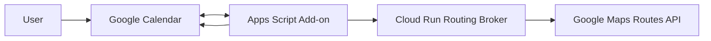
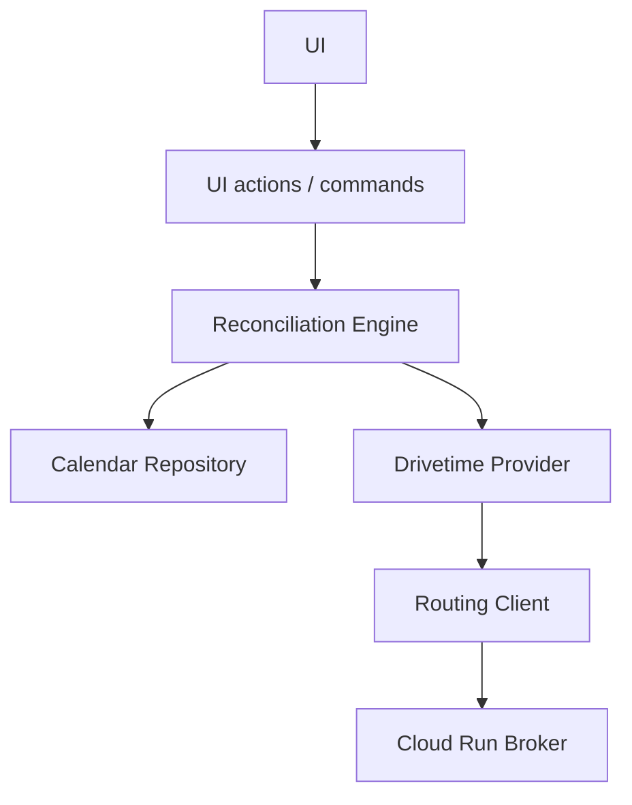
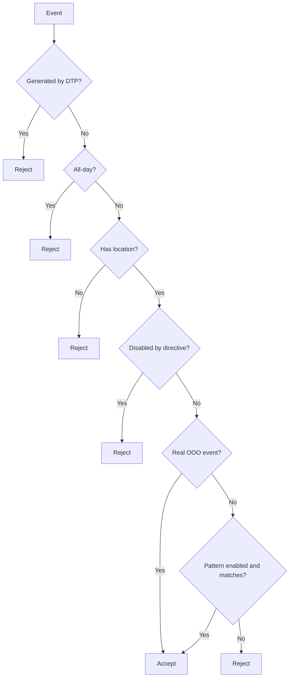
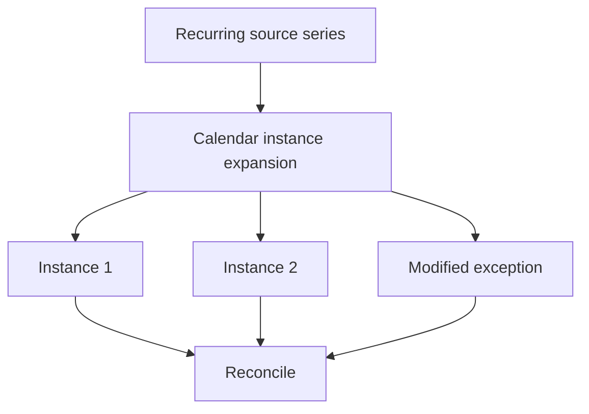
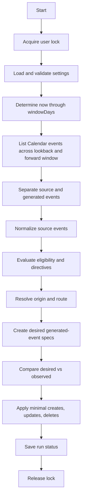
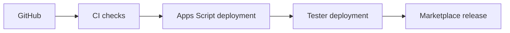
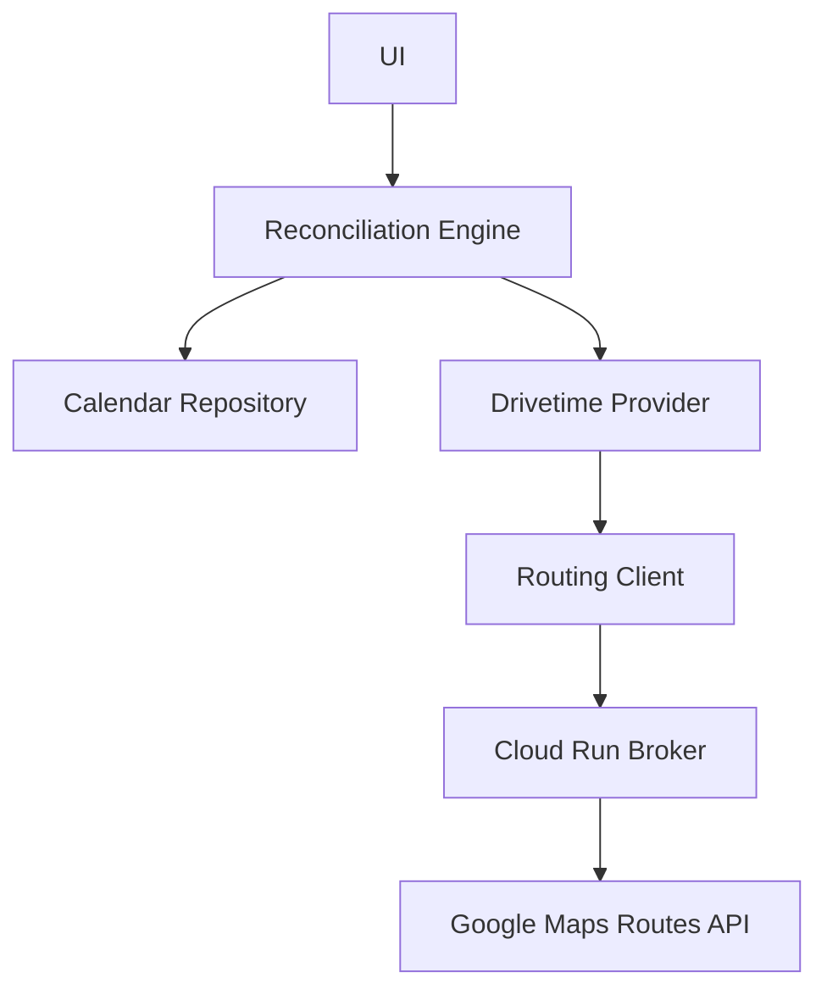

# Drivetime Padding Architecture

**Document version:** 1.0-draft  
**Project:** Drivetime Padding  
**Status:** Proposed implementation architecture  
**Primary runtime:** Google Apps Script  
**Distribution:** Google Workspace Marketplace  
**Routing backend:** Google Cloud Run + Google Maps Routes API

---

## 1. Executive Summary

Drivetime Padding is a Google Workspace Marketplace add-on that automatically creates and maintains travel-time events around eligible Google Calendar events.

The first supported use case is a timed Out of Office event representing an appointment away from the user's normal work location. When a qualifying event contains a destination in the Google Calendar `location` field, the add-on calculates the expected driving duration and creates two companion events:

1. an outbound travel event that ends when the source event begins; and
2. a return travel event that begins when the source event ends.

The generated events remain synchronized with the source event. If the source event is moved, resized, cancelled, deleted, or given a different location, the generated travel events are updated or removed. Recurring events are supported by expanding the series into concrete instances inside a rolling planning window and reconciling each instance independently.

The architecture is intentionally reconciliation-driven. The application does not try to infer which exact event caused a Calendar trigger. Instead, each synchronization run compares the state that should exist with the state that currently exists and applies the smallest safe set of changes.

Generated events are treated as disposable derived state. Google Calendar source events are authoritative. If generated events are deleted or corrupted, a later reconciliation recreates the correct state.

---

## 2. Product Goals

The product should solve one narrow problem extremely well:

> When a qualifying calendar event requires travel, automatically block the travel time before and after it.

The primary goals are:

- support ordinary consumer Google accounts;
- support Google Workspace accounts;
- distribute through Google Workspace Marketplace;
- require minimal infrastructure and operational work;
- create predictable, explainable results;
- support recurring events and recurring exceptions;
- preserve privacy by transmitting only route origin and destination to the routing backend;
- remain safe under retries, duplicate triggers, and partial failures;
- avoid unnecessary Calendar writes;
- keep the MVP small enough to implement and review confidently.

### 2.1 Non-goals for the MVP

The initial release does not attempt to support:

- arbitrary automation workflows;
- AI-based scheduling decisions;
- destination inference from event descriptions;
- attendee-address inference;
- Google Meet or conferencing-link inference;
- multiple calendars;
- shared organizational calendars;
- public transit, walking, or bicycling routes;
- continuous traffic-aware departure rescheduling;
- near-departure route refresh of any kind (see §21.3);
- routes longer than `MAX_TRAVEL_MINUTES`, currently six hours;
- billing, subscriptions, or premium plans;
- non-travel padding providers.

These are deferred rather than structurally prohibited.

---

## 3. Architectural Principles

### 3.1 Google Calendar is the source of truth

Only user-owned source events are authoritative.

Generated events may be deleted and recreated at any time. No external database is required to reconstruct the correct generated state.

### 3.2 Reconciliation over change processing

Calendar update triggers indicate that a calendar changed, but do not reliably identify the changed event. The application therefore does not implement a delta-processing model.

Each synchronization run answers:

> Given the current calendar and current settings, what generated events should exist?

This makes the system:

- idempotent;
- retry-safe;
- resilient to duplicate triggers;
- self-healing after partial failures;
- naturally compatible with recurring event exceptions.

### 3.3 Explicit input over inference

The system uses only explicit user-provided data:

- destination comes from the event `location` field;
- origin comes from configured origins, working-location state, or a per-event override;
- eligibility comes from real OOO event type or an optional user-configured subject pattern.

The system does not guess.

### 3.4 Generated events are derived cache entries

Generated events are best understood as a cache of deterministic calculations:

```text
source event
+ user settings
+ event directives
+ selected origin
+ route calculation
= desired generated events
```

This model simplifies recovery and removes the need for a persistent event-mapping database.

Route results are derived state under the same rule. A cached route duration is an optimization, never an authority:

```text
source event
    |
    v
route input hash
    |
    v
route plan cache  (may be discarded at any time)
    |
    v
generated events
```

The governing invariant is:

> Removing the route cache may increase broker calls, but must not change the final Calendar state.

### 3.5 Keep the architecture smaller than the problem domain

The system should remain extensible without becoming a generalized scheduling framework. The MVP uses one provider-like component for drivetime planning, but avoids extra abstractions that do not yet add practical value.

The final MVP architecture intentionally does **not** include a separate Planner layer or a generalized Capability framework.

---

## 4. High-Level Architecture



### 4.1 Google Calendar

Google Calendar stores:

- source events;
- generated outbound and return events;
- recurring series and expanded instances;
- private extended properties used to identify generated events.

Calendar is authoritative for event state.

### 4.2 Apps Script add-on

The Apps Script project provides:

- Marketplace-hosted add-on UI;
- user settings;
- trigger installation and repair;
- bounded synchronization;
- source event normalization;
- eligibility evaluation;
- per-event directive parsing;
- route broker invocation;
- generated-event reconciliation.

### 4.3 Cloud Run routing broker

The broker:

- authenticates add-on requests;
- validates route inputs;
- protects Google Maps credentials;
- calls Google Maps Routes API;
- returns normalized duration and distance values;
- centralizes billing, quotas, abuse prevention, and operational logging.

It does not receive event titles, descriptions, attendees, or recurrence details.

---

## 5. Internal Apps Script Architecture

The implementation should begin with a compact module structure.

```text
src/apps-script/
├── Code.js
├── Settings.js
├── Triggers.js
├── UI.js
├── ReconciliationEngine.js
├── CalendarRepository.js
├── DrivetimeProvider.js
├── RoutingClient.js
├── Normalizer.js
├── Eligibility.js
├── Directives.js
├── Fingerprint.js
└── appsscript.json
```

Modules should be split further only when growth justifies it.

### 5.1 Dependency direction



Infrastructure modules must not depend on UI modules.

### 5.2 UI responsibilities

The UI layer provides:

- home card;
- settings card;
- current-event diagnostic card;
- manual synchronization;
- trigger installation and repair;
- synchronization status.

The UI does not contain business logic. Manual synchronization calls the same engine used by automatic triggers.

### 5.3 Calendar repository

`CalendarRepository` hides Advanced Calendar API details and exposes business-oriented methods such as:

```javascript
listWindowEvents(calendarId, observeStart, observeEnd, pivot,
                 shouldStop, resumeToken)
listGeneratedEventsBetween(calendarId, start, end, shouldStop)
createGeneratedEvent(spec)
updateGeneratedEvent(observed, spec)
deleteGeneratedEvent(observed)
```

(The write operations take the observed event, not a bare id, so ownership can be re-verified at write time; both paged reads are deadline-aware, reporting truncation via `scanComplete`. The Technical Design interface reference is the authoritative listing. Like every module in the shared Apps Script namespace, these are **bare global functions** — there is no `repository` object to qualify calls with, and the pseudocode below calls them unqualified.)

The reconciliation engine should not directly call `Calendar.Events.insert`, `patch`, or `delete`.

### 5.4 Reconciliation engine

The `ReconciliationEngine` orchestrates the full synchronization lifecycle:

1. acquire lock;
2. load validated settings;
3. determine the rolling window;
4. list source and generated events;
5. normalize source events;
6. evaluate eligibility;
7. calculate desired generated-event specifications;
8. compare desired and observed state;
9. apply minimal writes;
10. save run status;
11. release lock.

The engine is provider-aware only through a narrow call:

```javascript
getGeneratedEventSpecs(context)   // DrivetimeProvider.js
```

(Apps Script files share one global namespace — there is no `DrivetimeProvider` object to qualify the call with; the file name is an organizational boundary only, per the §2 conventions of the Technical Design.)

### 5.5 Drivetime provider

The drivetime provider receives an immutable context containing:

- normalized source event;
- effective settings;
- parsed directives;
- resolved origin;
- routing client.

It returns zero or more `GeneratedEventSpec` objects. For the MVP a successful outcome carries up to two:

- `outbound`;
- `return`;

with a role omitted when its quantized route duration plus buffer is zero — Calendar rejects zero-length events (Technical Design §12.5).

The provider never writes to Calendar.

### 5.6 Routing client

The routing client:

- builds broker requests;
- authenticates them;
- handles broker errors;
- validates broker responses;
- returns normalized route duration and distance.

It prevents HTTP and authentication details from leaking into the provider.

---

## 6. Configuration Model

Settings are stored as a single JSON object in Apps Script User Properties.

```json
{
  "schemaVersion": 1,
  "enabled": true,
  "windowDays": 60,
  "defaultBufferMinutes": 7,
  "eligibility": {
    "includeOutOfOffice": true,
    "titlePatternEnabled": false,
    "titlePattern": "^OOO\\b",
    "caseSensitive": false
  },
  "origins": {
    "default": {
      "type": "address",
      "value": ""
    },
    "home": {
      "type": "address",
      "value": ""
    },
    "office": {
      "type": "address",
      "value": ""
    }
  },
  "workingLocation": {
    "enabled": true
  },
  "generatedEvents": {
    "titlePrefix": "[Drivetime Padding]"
  }
}
```

### 6.1 Validation

Recommended constraints:

- `windowDays`: 7 through 180;
- `defaultBufferMinutes`: 0 through 120;
- default origin: required before synchronization;
- subject pattern: must compile successfully when enabled;
- origin type: `address` or `placeId`.

Invalid configuration should produce a visible error and prevent event writes.

### 6.2 Schema migration

Every settings object has a `schemaVersion`.

Loading settings should:

1. parse JSON;
2. determine schema version;
3. migrate older versions sequentially;
4. validate;
5. save the migrated object;
6. return an immutable effective settings object.

---

## 7. Event Eligibility

A source event is eligible when all required conditions are true.



### 7.1 Real OOO events

Real Google Calendar Out of Office events are the default source type.

Generated companion events should also be created as OOO events when the source event is a real OOO event.

### 7.2 Pattern-matched ordinary events

Users may optionally enable a subject pattern.

Pattern-matched ordinary events remain ordinary generated events. They should not be converted into OOO events.

Their transparency or busy behavior should match the source where practical.

### 7.3 All-day events

All-day events are always ignored.

### 7.4 Missing locations

Events without a `location` are ineligible. The application does not infer a destination from any other field.

---

## 8. Per-Event Directives

Per-event directives are parsed from the source event description.

Supported initial forms:

```text
drivetime padding: off
drivetime padding: buffer=10m
drivetime padding: origin=home
drivetime padding: origin=office
drivetime padding: origin=default
```

Optional shorthand:

```text
drivetime padding +7m
```

The shorthand replaces the configured buffer rather than adding to it.

### 8.1 Parsing rules

- matching is case-insensitive;
- directives are line-oriented;
- unknown directives are ignored;
- malformed directives are ignored and logged as warnings;
- providers do not parse descriptions directly.

A parsed directive object may look like:

```json
{
  "disabled": false,
  "bufferMinutes": 10,
  "origin": "home"
}
```

---

## 9. Origin Resolution

Origin selection is deterministic.

Priority order:

1. per-event origin directive;
2. matching Calendar working-location event;
3. configured default origin.

### 9.1 Working location

When enabled, the application queries working-location events overlapping the source event time.

If the working location resolves to:

- home: use configured home origin;
- office: use configured office origin;
- another or unsupported type: use default origin.

If a home or office origin is selected but not configured, fall back to default.

### 9.2 Address and Place ID support

Each configured origin may contain:

```json
{
  "type": "address",
  "value": "123 Main Street, Florence, CO"
}
```

or:

```json
{
  "type": "placeId",
  "value": "ChIJ..."
}
```

The routing broker normalizes both forms.

### 9.3 Return route

The return route always ends at the same effective origin selected for the outbound route.

---

## 10. Recurring Events

The system does not create mirrored recurring travel series.

Instead, the Calendar API is queried with recurring expansion enabled inside the rolling window. Each concrete instance is treated like an ordinary event.



### 10.1 Moved instances

A moved recurring instance appears as a concrete exception with its current start, end, and location. Reconciliation updates only that instance's generated events.

### 10.2 Cancelled instances

A cancelled instance no longer appears in desired state. Existing generated events linked to it become orphans and are deleted.

### 10.3 "This and following"

Google Calendar may split the series. The application does not need special handling beyond processing the resulting concrete instances.

### 10.4 Window advancement

A daily trigger advances the far edge of the rolling window. Newly visible instances receive generated events naturally.

---

## 11. Generated Event Specifications

The provider returns immutable `GeneratedEventSpec` objects.

Conceptual structure:

```typescript
interface GeneratedEventSpec {
  role: "outbound" | "return";
  parentEventId: string;
  parentICalUID?: string;
  parentOriginalStart?: string;
  summary: string;
  start: string;
  end: string;
  eventType: string;
  transparency?: string;
  metadata: Record<string, string>;
  fingerprint: string;
}
```

The object contains intent, not Calendar state. It has no Calendar event ID.

### 11.1 Subjects

Recommended subjects:

```text
[Drivetime Padding] Travel to Doctor appointment
[Drivetime Padding] Return from Doctor appointment
```

The title prefix is cosmetic and user-visible. It is not used as the authoritative identifier.

### 11.2 Event fields not copied

Generated events do not copy:

- attendees;
- conferencing;
- attachments;
- guest notifications;
- reminders from the source;
- source description.

This prevents accidental invitation behavior and keeps generated events simple.

---

## 12. Generated Event Metadata

Private extended properties identify managed events.

Recommended compact metadata:

```json
{
  "dtp": "1",
  "schema": "1",
  "parent": "source-instance-id",
  "ical": "source-ical-uid",
  "originalStart": "2026-07-24T14:00:00-05:00",
  "anchor": "2026-07-24T14:00:00-05:00",
  "role": "outbound",
  "fingerprint": "sha256-value"
}
```

The return event uses `"role": "return"`.

### 12.1 Why metadata is authoritative

Titles may be edited and localized. Metadata is private, stable, and intended for application use.

### 12.2 Unknown metadata

When patching generated events, the application should preserve private metadata keys it does not recognize where practical.

### 12.3 Missing metadata

If a user somehow removes all Drivetime Padding metadata, the event becomes unmanaged. The application must not delete it based on title alone.

If the source still qualifies, a new managed generated event will be created.

---

## 13. Fingerprints

Fingerprints reduce Calendar churn and duplicate trigger activity.

Recommended inputs:

- parent event ID;
- role;
- source anchor — the one source boundary this companion depends on: `source.start` for outbound, `source.end` for return (Technical Design §14.1);
- effective origin type and value;
- destination;
- route duration, rounded up to 5-minute granularity (§21.4);
- buffer;
- generated summary;
- generated event type;
- metadata schema version.

Inputs should be canonically serialized:

- sorted keys;
- ISO-8601 timestamps;
- trimmed strings;
- normalized whitespace.

Hash using SHA-256.

A matching fingerprint means the **desired** state has not changed. It does not prove the **observed** event still matches it: Calendar preserves private metadata through a user edit, so a moved, resized, renamed, or reminder-altered generated event still carries a matching fingerprint while sitting in the wrong state. Skipping the write is therefore permitted only when the fingerprint matches **and** the observed owned fields match the desired specification (Technical Design §15.2.1, REQ-GEN-014a).

The fingerprint remains the cheap first check; the owned-field comparison is what makes reconciliation self-healing.

---

## 14. Reconciliation Algorithm

### 14.1 Full flow



### 14.2 Pseudocode

```javascript
function reconcile(options) {
  // One warning buffer for the whole run, created before ANY result is
  // built -- the lock-contention skip below included, since every
  // result builder installs this same array by reference as
  // diagnostics.warnings (interfaces; 4.11 declares the field
  // non-optional). recordRunWarning appends to it; the comparator
  // installs it into diff.diagnostics.
  beginRunWarnings();

  const lock = LockService.getUserLock();

  if (!lock.tryLock(5000)) {
    // Complete ReconciliationResult shape, not a bare status object --
    // REQ-RECON-012 requires the structured fields on every run, and
    // callers must not special-case one state (technical design §17.2).
    return buildStatusOnlyResult("skipped", "lock-contention", options);
  }

  // Wall clock for the execution budget (§23.1 of the technical design).
  // Distinct from the injected domain clock `now`: tests can freeze
  // domain time, but elapsed runtime is real either way.
  const runStart = Date.now();

  // Hoisted above the try so the finally can record diagnostic broker
  // spend even when the run throws -- otherwise a diagnostic that fails
  // AFTER its broker calls bypasses the hourly counter, and reopening the
  // card becomes exactly the unbounded spend §20.3's ceiling exists to
  // prevent.
  const isDiagnostic = options.reason === "event-diagnostic";
  let routeBudget = null;
  let initialBudget = 0;
  let now = null;
  // True when a cursor-OFFERED listing walked off the end -- resumed
  // mid-chain, or a rejected-token fallback that covered the whole
  // pinned span: either way the chain's coverage work is done and the
  // cursor clears (§7.2.1, §19.6).
  let chainFinished = false;
  // The cursor write DECIDED at listing time but PERSISTED post-apply
  // (§7.2.1): { action: "clear" | "save" | "saveIfNone", cursor? }.
  let pendingCursorWrite = null;

  try {
    // §17.1: eventIdFilter and reason "event-diagnostic" are one package,
    // enforced in BOTH directions, plus dryRun. A scoped run without the
    // reason would draw the ordinary 60-attempt budget on every card open
    // with none of the spend recorded, bypassing the §20.3 hourly
    // ceiling; the reason without the scope (or without dryRun) would
    // point a full -- even write-mode -- reconcile at the shared
    // 20-attempt hourly allowance and drain it for every genuine card
    // open that hour. And a scoped run carries deletion authority over a
    // comparison that deliberately cannot see everything else, so it is
    // dry-run only. One canonical invocation, enforced rather than
    // assumed.
    //
    // Checked FIRST -- a pure contract check on the options, ahead of any
    // settings read or gate. The disabled gate below consumes
    // eventIdFilter to synthesize its diagnostics payload; checking the
    // contract after it would let an invalid scoped invocation against a
    // disabled install return a plausible-looking result, and the
    // caller's bug would surface only after the user re-enables.
    if (Boolean(options.eventIdFilter) !== isDiagnostic ||
        (options.eventIdFilter && !options.dryRun)) {
      const rejection = buildFailureResult(
        new Error(
          "eventIdFilter, reason 'event-diagnostic', and dryRun go together"),
        options);
      // Persisted like every other locked non-dry exit (technical
      // design §20.2): the caller's bug should be visible in the
      // last-run record, not hidden behind the previous outcome.
      if (!options.dryRun) {
        saveRunStatusGuarded(rejection);
      }
      return rejection;
    }

    // Validation failure is an explicit failed result, not a throw: it
    // must reach the stored record with INVALID_SETTINGS, and the failure
    // carries the validation errors so the diagnostic card can show the
    // user what is wrong (technical design §5.3) instead of a bare error.
    //
    // Two tiers (technical design §5.3): structural validity (types,
    // ranges, regex) gates EVERY run; write-readiness (a configured
    // default origin) gates writes only. A dry-run diagnostic proceeds
    // without a default origin and reports MISSING_DEFAULT_ORIGIN per
    // event (§10.4) -- blocking it here would hide exactly the
    // diagnostics that tell the user what to configure.
    const { settings, validation } = loadSettings();
    if (!validation.structurallyValid) {
      const failure = buildFailureResult(validation, options);
      // Guarded like every other persistence site: a transient
      // Properties throw here would enter the boundary and REPLACE the
      // INVALID_SETTINGS result -- and its full validation list, the
      // card's reset guidance -- with a generic persistence failure.
      // The stored record goes stale; the returned result stays true.
      if (!options.dryRun) {
        saveRunStatusGuarded(failure);
      }
      return failure;
    }

    // Disabled is checked BEFORE write-readiness. The remove-all tombstone
    // is the 5.2 defaults with enabled: false -- self-contained and
    // schema-complete, with empty origins -- and a disabled install must
    // report "disabled", not manufacture a MISSING_DEFAULT_ORIGIN failure
    // record moments after cleanup cleared the last one.
    //
    // A scoped diagnostic still owes the card a payload: this gate sits
    // BEFORE the targeted read, buildEventCard renders
    // result.eventDiagnostics, and REQ-UI-012 promises every opened event
    // an eligibility answer -- a bare status here would render a blank
    // card for exactly the state the user most needs explained.
    // DISABLED_GLOBALLY is already in the 4.5 reason registry.
    if (!settings.enabled) {
      const disabled = buildStatusOnlyResult("disabled", null, options);
      if (options.eventIdFilter) {
        disabled.eventDiagnostics = buildUnresolvedEventDiagnostics(
          options.eventIdFilter, "DISABLED_GLOBALLY");
      }
      // Persisted like every other non-dry exit (technical design
      // §20.2): a leftover trigger or direct invocation after disable
      // must update the last-run record, or the home card keeps showing
      // the previous outcome as the most recent invocation.
      if (!options.dryRun) {
        saveRunStatusGuarded(disabled);
      }
      return disabled;
    }

    if (!options.dryRun && !validation.writeReady) {
      const failure = buildFailureResult(validation, options);
      // Same guard as the structural branch above: the returned
      // validation result must survive a persistence outage.
      saveRunStatusGuarded(failure);
      return failure;
    }

    // Counted HERE, under the lock -- not in the trigger handler. A
    // handler-side increment races the reset a concurrent successful run
    // performs, losing one or the other; behind the lock the two cannot
    // interleave, and a skipped run never reaches this line so no refund
    // path exists. Before any substantive work, so a crashed continuation
    // still counted itself (technical design §19.6).
    if (options.reason === "continuation" && !options.dryRun) {
      incrementContinuationCount();
    }

    // The DAILY run is the episode boundary: it resets the allowance
    // unconditionally, under the lock, before substantive work
    // (technical design §19.6). Without this, a calendar too large for
    // any single scan -- where no run is ever `success` -- would hit the
    // cap once and disable continuations permanently; resetting on mere
    // chain completion instead would let a persistently-partial cause
    // chain fresh scans forever. Guarded like the other counter writes.
    if (options.reason === "daily-trigger" && !options.dryRun) {
      try {
        resetContinuationCount();
      } catch (persistError) {
        recordRunWarning("BOOKKEEPING_PERSIST_FAILED", persistError);
      }
    }

    // One clock for the whole run. Triggers pass no `now`, so default it
    // here; every later consumer (window, cache-age checks, provider
    // context) reuses this value rather than reading the clock again.
    now = options.now || new Date();

    // Two ranges: plan* selects sources, observe* selects generated
    // events to read. The second is strictly wider (§21.2).
    const window = calculateWindow(settings.windowDays, now);

    // Companions left beyond a shrunken horizon are invisible to the
    // window read, so they need their own ownership-filtered pass
    // (§21.2, technical design §7.6). Runs FIRST among the bulk reads
    // (§23.1 order): this read has no cursor -- it progresses only
    // because its applied deletions shrink the next listing -- while
    // the window listing below deliberately consumes the whole read
    // region on oversized calendars and RESUMES by cursor, losing
    // nothing by running second. Ordered the other way, this
    // unresumable read would start with the shared guard already true
    // on every such run, list nothing, and freeze the high-water mark
    // forever. (A large shrink backlog transiently starving the window
    // scan is the accepted, self-draining converse -- REQ-TRIGGER-002.)
    // Its results merge into the diff after the comparator.
    // Skipped entirely on a filtered diagnostic: the scan of the vacated
    // range costs real Calendar quota on the hot card-open path, a dry
    // run can never lower the mark, and the card does not render cleanup
    // results (technical design §17.1).
    const cleanup = options.eventIdFilter
      ? { shrunk: false, events: [], scanComplete: true }
      : findStrandedCompanions(window, settings, options.dryRun,
          () => elapsedExceedsReadBudget(runStart));

    // Diagnostics read narrowly: the opened event by id plus its managed
    // companions by parent metadata, never the full window scan. An event
    // beyond the observation range is invisible to the bounded listing --
    // the card could not even say OUTSIDE_WINDOW, only silence -- and a
    // full window read on every card open is exactly the hot path the
    // hourly budget protects (technical design §17.1). The targeted reads
    // are complete for the one parent this run compares.
    let allEvents;
    let scanComplete;
    let diagnosticRedirected = false;
    // The id the scoped diagnostic actually planned (the redirect
    // target) -- the post-loop synthesis looks its outcome up here.
    let diagnosticTargetId = null;
    if (options.eventIdFilter) {
      let targetId = options.eventIdFilter;
      let target = getEventById("primary", targetId);

      // Opening a COMPANION redirects to its parent: a companion has no
      // desired state of its own, and diagnosing it directly would leave
      // its parent unevaluated -- the comparator would then classify the
      // very event the user is inspecting as an orphan and propose
      // deleting it (technical design §17.1). The parent id is VALIDATED
      // before it is used: dtp=1 does not guarantee the rest of the
      // metadata survived, and a blank or missing parent sent into the
      // point read or the companion listing can throw before the
      // PARENT_NOT_FOUND fallback below ever runs. An unresolvable
      // redirect issues no further repository calls; the unresolved-
      // diagnostics path then reports PARENT_NOT_FOUND for the clicked
      // event.
      if (target && isGeneratedEvent(target)) {
        diagnosticRedirected = true;
        const parentId = target.extendedProperties.private.parent;
        targetId = (typeof parentId === "string" && parentId.trim() !== "")
          ? parentId
          : null;
        target = targetId ? getEventById("primary", targetId) : null;
      }
      diagnosticTargetId = targetId;

      const companions =
        targetId ? listCompanionsByParent("primary", targetId) : [];
      allEvents = (target ? [target] : [])
        .concat(companions.map(companion => companion.rawEvent));
      scanComplete = true;
    } else {
      // Deadline-aware, on the READ budget (technical design §23.1):
      // bulk listings stop at READ_BUDGET_FRACTION of the execution
      // threshold, reserving headroom to plan and APPLY what was
      // retrieved -- a read guarded by the full threshold returns with
      // that check already true, everything it read is marked failed,
      // and on a resumable scan the cursor advances past a slice
      // nothing reconciled. (The per-event evidence passes below get
      // their own later tier, EVIDENCE_BUDGET_FRACTION -- a listing
      // that exhausts this one must not starve them.) Truncation is a
      // first-class state downstream (§15.2.4, §15.2.8, §7.6).
      //
      // RESUMABLE (technical design §7.2.1): continuation AND daily
      // runs resume a truncated predecessor's listing from the persisted
      // cursor, PINNED to the stored observation range -- a page token
      // is valid only for its own query, and successive slices must tile
      // one span. The daily run resumes too: a chain longer than one
      // day's continuation allowance must survive the episode boundary
      // or the tail of the range is never reached (on ordinary calendars
      // no cursor is pending at daily time). Calendar-trigger and manual
      // runs scan fresh, but the pending cursor is the CHAIN's --
      // ownership rules below. loadWindowScanCursor never throws and
      // validates the stored shape: absent, malformed, or unreadable
      // cursors return null and the run scans fresh (AC-RECOVERY-017).
      let resume = null;
      if (options.reason === "continuation" ||
          options.reason === "daily-trigger") {
        resume = loadWindowScanCursor();        // null when none stored
      }
      // The pivot splits the read into a forward segment from `now`
      // and a backward one, each ordered by start time, so pages arrive
      // upcoming-first (technical design §7.2.1, §23.2). It is pinned
      // with the range: every slice of one chain splits at one instant.
      const scanRange = resume || {
        observeStart: window.observeStart,
        observeEnd: window.observeEnd,
        pivot: now
      };
      let nextPageToken = null;
      let resumed = false;
      ({ events: allEvents, scanComplete, nextPageToken, resumed } =
        listWindowEvents(
          "primary",
          scanRange.observeStart,
          scanRange.observeEnd,
          scanRange.pivot,
          () => elapsedExceedsReadBudget(runStart),
          resume ? resume.pageToken : null
        ));
      // Slice semantics key on whether a cursor was OFFERED: any run
      // that listed the chain's PINNED range -- resumed mid-chain, or
      // fallen back to that range's first page on a rejected token --
      // covered a span that may be stale, so it never claims
      // complete-scan credit for the CURRENT window (`resumed` reports
      // whether the token was honored; either way the range listed was
      // the stored one). Walking off the end means the CHAIN finished
      // -- the pinned span is fully covered and the cursor clears --
      // not that this run observed the current window. A rejected
      // token's cursor must not survive: leaving it stored would make
      // every later resume retry it, fall back, and re-read the same
      // first-page prefix indefinitely. Its CLEAR is eager, just below;
      // the fallback's own nextPageToken then saves through the
      // application-gated path when this run applies, restarting the
      // chain over the same span.
      const offeredResume = Boolean(resume);
      chainFinished = offeredResume && scanComplete;
      if (offeredResume) {
        scanComplete = false;
      }
      if (offeredResume && !resumed && !options.dryRun) {
        // A rejected token must not survive even a failed run: left
        // stored, every later resume would retry it, fall back, and
        // re-read the same prefix -- and a pre-apply timeout would skip
        // a deferred replacement indefinitely. The EAGER CLEAR is the
        // one cursor write exempt from application-gating because it is
        // skip-safe: clearing only restarts the chain, while an eager
        // replace could advance past the fallback's own unprocessed
        // pages. The post-apply write below then starts a fresh chain
        // from the fallback's stop point when this run applies
        // (technical design §7.2.1).
        try {
          clearWindowScanCursor();
        } catch (persistError) {
          recordRunWarning("BOOKKEEPING_PERSIST_FAILED", persistError);
        }
      }
      // The cursor DECISION is made here -- Cursor OWNERSHIP (technical
      // design §7.2.1): the pending cursor belongs to the chain; a
      // resumed run advances it (truncated) or clears it (chain
      // finished); a fresh run starts a chain only when none is stored
      // (never overwriting a pending one) and a fresh COMPLETE scan
      // clears any pending cursor. Its PERSISTENCE waits for the
      // post-apply bookkeeping block below: a SAVE committed at listing
      // time would survive a normalization, planning, or apply-time
      // throw -- the catch builds a failed result with no continuation,
      // and the next resume would skip a slice nothing processed -- so
      // saves execute only after application ran; a failed or
      // out-of-time run leaves the prior cursor and the retry re-reads
      // the slice, wasteful, never wrong. CLEARS execute even when
      // application is skipped for time: every clear decision is
      // skip-safe (a finished chain's clear costs one fresh re-scan; a
      // fresh complete scan supersedes the stale chain it clears), and
      // a retained moot cursor would send the very continuation an
      // out-of-time run schedules down the stale pinned span instead
      // of the current window (technical design §7.2.1).
      if (offeredResume) {
        pendingCursorWrite = chainFinished
          ? { action: "clear" }
          : nextPageToken
            ? { action: "save",
                cursor: { pageToken: nextPageToken,
                          observeStart: scanRange.observeStart,
                          observeEnd: scanRange.observeEnd,
                          pivot: scanRange.pivot } }
            : null;
      } else if (scanComplete) {
        pendingCursorWrite = { action: "clear" };
      } else if (nextPageToken) {
        // saveIfNone: the no-pending-cursor check runs at write time --
        // a fresh truncated run STARTS a chain only when none is stored.
        pendingCursorWrite =
          { action: "saveIfNone",
            cursor: { pageToken: nextPageToken,
                      observeStart: scanRange.observeStart,
                      observeEnd: scanRange.observeEnd,
                      pivot: scanRange.pivot } };
      }
    }

    // Raw Calendar resources are flattened into the ObservedGeneratedEvent
    // contract (key, parentEventId, anchor, fingerprint, observedFields,
    // routeCache -- the anchor feeds the §15.2.9 freeze and displacement
    // tests) before anything consumes them. The comparator and the cache lookup
    // both depend on that shape; raw resources would match nothing.
    //
    // Cancelled generated tombstones are excluded: showDeleted returns a
    // manually deleted companion with its dtp metadata intact, and treating
    // it as an existing companion would suppress the recreate the deletion
    // calls for -- deleted means absent (technical design §7.3). Source
    // tombstones still flow through eligibility.
    const observedAll = allEvents
      .filter(isGeneratedEvent)
      .filter(event => event.status !== "cancelled")
      .map(normalizeObservedGeneratedEvent)
      // null = id or ownership marker unrecoverable (§8.1): unsafe to
      // delete (§15.3) or even address -- excluded with the warning the
      // normalizer logged, left inert. Defense in depth: the
      // ownership-filtered listing guarantees the marker, and Calendar
      // resources always carry an id.
      .filter(Boolean);
    // KEYLESS survivors -- valid id and marker, unrecoverable
    // parentEventId/role (§8.1): unmanageable. Nothing key-based can
    // match, restore, or preserve them, so they leave the observed set
    // and, unless the lenient §15.2.9 deletion-side test keeps them
    // (isPreservedRecord -- possible history), queue for deletion below. Deleting is self-healing: a
    // genuinely desired block is recreated with clean metadata by its
    // parent's own planning.
    const observedGenerated = observedAll.filter(event => event.key);
    const unmanageableCorrupt = observedAll.filter(event =>
      !event.key && !isPreservedRecord(event, now));
    const sourceEvents = allEvents.filter(event => !isGeneratedEvent(event));

    // Index observed companions by parentEventId|role BEFORE planning, so
    // their route cache entries are reachable from the provider context.
    // Without this the cache cannot be consulted and every run calls the
    // broker (ADR 0011, Technical Design 12.1.1). Every companion of a
    // key is kept: the per-role choice is companionsFor's, below, which
    // needs the source's anchors.
    const observedByKey = indexByGeneratedKey(observedGenerated);

    const desiredSpecs = [];

    // Outcomes, not just specs. The comparator may delete a companion only
    // when its parent was PLANNED or INELIGIBLE; a parent whose planning
    // FAILED keeps its existing events. Dropping ineligible parents with a
    // bare `continue` would erase that distinction and let a broker outage
    // look identical to a cancelled appointment (§17.3-17.4 of the
    // technical design).
    const planningOutcomes = new Map();

    // Companions of overlong sources, found by targeted lookup because the
    // window read cannot reach them (technical design §15.2.6).
    const strandedOverlong = [];

    // Per-event payload for the diagnostic card (technical design §17.6).
    // Eligibility, directives, origin, and route provenance are loop
    // locals; without an explicit capture they are discarded and the
    // filtered run's result would carry nothing for the card to render.
    let eventDiagnostics = null;

    // Working-location events feed origin resolution. Fetched once per run,
    // over the OBSERVATION range, not the planning range -- an evaluated
    // source can extend past planEnd (intersection eligibility), and a
    // working-location event overlapping only that overhang would be
    // excluded by a planEnd-bounded query, silently degrading its origin
    // to the default. The observation range covers every evaluated
    // source's full span by construction (technical design §7.2, §10.3).
    //
    // Guarded independently: this read is OPTIONAL data. On accounts
    // where working locations are unsupported, an unguarded call would
    // throw into the run-wide catch and fail every synchronization --
    // technical design §7.5 requires unavailable data to degrade to the
    // default origin, not fail the run (fetchWorkingLocationsSafely
    // catches, records WORKING_LOCATION_UNAVAILABLE, returns []).
    //
    // Filtered diagnostics fetch inside the loop over the ONE source's
    // span instead -- an observation-range listing per card open is
    // exactly the cost the targeted read exists to remove.
    let workingLocations = [];
    if (settings.workingLocation.enabled && !options.eventIdFilter) {
      workingLocations = fetchWorkingLocationsSafely(
        window.observeStart, window.observeEnd);
    }

    // One shared HTTP-attempt budget for the whole run, decremented by the
    // routing client for every request on the wire, retries included
    // (technical design §11.2). Created here because only the engine spans
    // the run; the planning layer cannot see retries.
    //
    // Diagnostics draw from the hourly allowance instead -- reopening the
    // event card must not grant a fresh 60 attempts per open (technical
    // design §20.3, DIAGNOSTIC_ROUTE_CALLS_PER_HOUR). The allowance is
    // RESERVED here, before any broker call, not recorded after: a
    // post-call write failure would leave the stored count stale while
    // the calls already happened, and the next card open would be
    // granted the same allowance again -- reservation inverts that, so
    // a later refund failure under-grants instead of over-spending.
    // reserveDiagnosticAllowance fails CLOSED (any Properties error
    // grants 0).
    initialBudget = isDiagnostic
      ? reserveDiagnosticAllowance(now)
      : MAX_ROUTE_CALLS_PER_RUN;
    routeBudget = { remaining: initialBudget };

    // Upcoming events first, then in-progress and lookback events. The
    // listing arrives in API response order; without reordering, past
    // events can exhaust the route budget while the appointment the user
    // is about to drive to sits unplanned (technical design §23.2).
    // Events without timestamps (cancelled tombstones) sort last.
    const orderedSources = orderForPlanning(
      sourceEvents.map(normalizeCalendarEvent), now);

    for (const event of orderedSources) {
      // Approaching planning's own tier boundary (technical design
      // §23.1 -- PLANNING_BUDGET_FRACTION, ahead of the evidence tier:
      // route calls at seconds each could otherwise burn straight
      // through the evidence passes' slice of the deadline and starve
      // the absence-gated work they license): stop planning, but FIRST
      // give every unprocessed source a failed outcome
      // (EXECUTION_BUDGET_EXCEEDED). Absence from planningOutcomes plus a
      // complete scan reads as orphaned -- a bare break would hand
      // deletion authority over the remaining sources' companions to the
      // degradation path (technical design §23.1).
      if (elapsedExceedsPlanningBudget(runStart)) {
        markRemainingSourcesFailed(orderedSources, event, planningOutcomes);
        // A filtered target among the just-marked sources is handled by
        // the single post-loop synthesis site, which reads its failed
        // outcome from planningOutcomes (technical design §17.1).
        break;
      }
      try {
        const directives = parseDirectives(event.description);
        const eligibility = evaluateEligibility(event, directives, settings, window);

        // Computed in the engine because the diagnostic capture needs it
        // even when planning never runs or fails before specs exist -- the
        // card's effectiveBufferMinutes cannot be inferred from timestamps
        // that were never produced (technical design §17.6).
        const effectiveBuffer = effectiveBufferMinutes(directives, settings);

        if (!eligibility.eligible) {
          planningOutcomes.set(event.id, {
            state: "ineligible",
            specs: [],
            reason: eligibility.reason
          });

          if (options.eventIdFilter) {
            eventDiagnostics = captureEventDiagnostics(
              event, eligibility, directives, null, null, effectiveBuffer);
          }

          // A source edited past MAX_SOURCE_DURATION breaks the observability
          // guarantee: it stays readable while its companions may sit behind
          // observeStart, where the window read above cannot see them. Keyed
          // on the duration, not the reason -- a multi-day all-day conversion
          // strands companions the same way but classifies ALL_DAY_EVENT
          // before the duration is ever tested (technical design §15.2.6).
          // Skipped on filtered diagnostics: §17.1 skips the cleanup passes,
          // and the targeted read already listed this parent's companions
          // unbounded -- the comparator sees them without a second fetch.
          if (!options.eventIdFilter &&
              sourceExceedsDurationCap(event) &&
              !bothRolesObserved(observedByKey, event.id)) {
            strandedOverlong.push(
              ...listCompanionsByParent("primary", event.id)
            );
          }
          continue;
        }

        if (settings.workingLocation.enabled && options.eventIdFilter) {
          // Dates, not the NormalizedEvent's ISO strings -- the unfiltered
          // call above passes calculateWindow's Date outputs, and a mixed
          // signature would make every diagnostic throw inside the safe
          // wrapper and degrade the origin to default with a spurious
          // WORKING_LOCATION_UNAVAILABLE warning.
          workingLocations = fetchWorkingLocationsSafely(
            new Date(event.start), new Date(event.end));
        }

        const origin = resolveOrigin(event, directives, settings, workingLocations);

        // Null means every fallback bottomed out at a blank default origin
        // (technical design §10.4). Reachable only on dry runs -- writeReady
        // gates write mode on a configured default -- and it must become a
        // per-event FAILED outcome here, in this explicit branch: the
        // per-event containment below would catch a throw, but as a
        // generic code with no in-loop capture, while §10.4 promises the
        // diagnostic reports MISSING_DEFAULT_ORIGIN with its
        // reset-the-origin guidance. The branch exists for reason-code
        // fidelity and the capture, not to prevent silence. failed
        // preserves existing companions like any other planning failure
        // (§17.3).
        if (!origin) {
          const outcome = {
            state: "failed",
            specs: [],
            error: buildAppError("MISSING_DEFAULT_ORIGIN", event)
          };
          planningOutcomes.set(event.id, outcome);
          if (options.eventIdFilter) {
            eventDiagnostics = captureEventDiagnostics(
              event, eligibility, directives, null, outcome, effectiveBuffer);
          }
          continue;
        }

        // A directive that named an unconfigured home/office origin fell
        // back to default -- the user's explicit selection was ignored, and
        // §10.2 requires that to be visible, not silent (technical design
        // §18.2, DIRECTIVE_ORIGIN_UNCONFIGURED). Compared by NAME, not by
        // source: an honored `origin=default` directive must not warn, and
        // the design does not pin which source value it reports.
        if (directives.origin && origin.name !== directives.origin) {
          recordRunWarning("DIRECTIVE_ORIGIN_UNCONFIGURED", null);
        }

        // eligibility.matchedBy travels with the context: the companion type
        // follows the MATCH, not the source type -- an OOO source qualified
        // through the title pattern gets ordinary companions (technical
        // design §12.6, AC-ELIG-007), and only the match can tell those
        // paths apart.
        const context = buildProviderContext({
          event,
          directives,
          settings,
          origin,
          matchedBy: eligibility.matchedBy,
          // The desired role set, derived once here from the eligibility
          // just evaluated (technical design §12.5) -- the provider never
          // re-evaluates eligibility, and §15.2.3's evaluation derives
          // the same set for a fetched parent.
          desiredRoles: routeFreeDesiredRoles(eligibility),
          window,
          now,
          routeBudget,
          // The resolved companions themselves, not just their cache
          // triplets: getGeneratedEventSpecs applies the §15.2.9 freeze
          // (strictly concluded + anchor equality + not provably live)
          // before routing, and a triplet-only context could not
          // recognize the record. Per role the SAME-ANCHOR companion,
          // whatever its state; else a live one over a record (§12.1.1).
          observedCompanions: companionsFor(observedByKey, event, now)
        });  // named fields: a new one can never shift its neighbours

        // Global, not namespaced: Apps Script files share one namespace
        // and the skeleton declares the bare function -- a qualified call
        // would ReferenceError on the first eligible event.
        const outcome = getGeneratedEventSpecs(context);
        planningOutcomes.set(event.id, outcome);

        if (options.eventIdFilter) {
          eventDiagnostics = captureEventDiagnostics(
            event, eligibility, directives, origin, outcome, effectiveBuffer);
        }

        if (outcome.state === "planned") {
          desiredSpecs.push(...outcome.specs);
        }
      } catch (eventError) {
        // One poisoned source must not fail the run: with cursor writes
        // application-gated (technical design §7.2.1), a run-wide throw
        // from a deterministically malformed event would freeze the
        // scan chain at its slice forever. failed preserves the
        // source's companions like any planning failure (§17.3) and is
        // NOT silent: buildRunResult folds the outcome's error into
        // result.errors, and a RETRYABLE failed outcome -- this one
        // always is: UNEXPECTED_ERROR is retryable by definition, and
        // a preserved registry code carries its own flag -- caps a
        // non-dry run at partial (§17.4), so the counter is never
        // reset over unplanned work and the next run re-plans
        // (transient throws retry naturally). The raw throw is logged here; the outcome carries
        // the registry record. A throw already carrying an §18.2
        // registry code KEEPS it -- the overlong branch's Calendar read
        // can throw a transient CALENDAR_READ_FAILED, and blanket
        // UNEXPECTED_ERROR would misclassify a routine API blip as an
        // internal error, losing the registry's retryability; only
        // unrecognized throws code UNEXPECTED_ERROR.
        const failureCode =
          registryCodeOf(eventError) || "UNEXPECTED_ERROR";
        logWarning(failureCode, eventError);
        planningOutcomes.set(event.id, {
          state: "failed",
          specs: [],
          error: buildAppError(failureCode, event)
        });
        // A filtered target is handled by the single post-loop
        // synthesis site, which reads this failed outcome.
      }
    }

    // The SINGLE synthesis site for every way the target can lack a
    // captured payload (technical design §17.1). Both loop branches
    // capture, so a filtered run with no payload here means the loop
    // never captured for the target: the id resolved no source event
    // (gone, or a companion's parent reference points at a purged
    // event), the planning-tier boundary marked it failed before its
    // iteration ran, or its iteration threw into the per-event
    // containment. Synthesize rather than return null -- silence is
    // the failure mode the targeted read exists to eliminate -- and
    // synthesize the TRUTH: a failed outcome's own error code
    // (EXECUTION_BUDGET_EXCEEDED, UNEXPECTED_ERROR) for an event the
    // targeted read just returned, never a not-found the user would
    // read as "this event does not exist" (technical design §4.5).
    if (options.eventIdFilter && !eventDiagnostics) {
      const targetOutcome = diagnosticTargetId
        ? planningOutcomes.get(diagnosticTargetId)
        : null;
      // failed outcomes carry error by contract (technical design
      // §17.4); the || is defense in depth, not license to omit it.
      // CLAMPED to the §4.5 EligibilityReason enum: the containment
      // catch deliberately preserves recognized registry codes in the
      // outcome, but the card's reason rendering is exhaustive over
      // §4.5, so a non-enum code renders as UNEXPECTED_ERROR here. The
      // true code still lands in result.errors (the buildRunResult
      // fold) and the log for diagnosis -- the card itself renders
      // eventDiagnostics, not errors, on this path, and shows the
      // clamped reason; reopening the card retries the whole scoped
      // run anyway, which is all a transient code would invite.
      const failedCode = targetOutcome && targetOutcome.state === "failed"
        ? (targetOutcome.error || { code: "UNEXPECTED_ERROR" }).code
        : null;
      eventDiagnostics = buildUnresolvedEventDiagnostics(
        options.eventIdFilter,
        failedCode
          ? (failedCode === "EXECUTION_BUDGET_EXCEEDED"
              ? failedCode : "UNEXPECTED_ERROR")
          : diagnosticRedirected ? "PARENT_NOT_FOUND" : "EVENT_NOT_FOUND");
    }

    // A filtered diagnostic already read only the opened event's
    // companions (the targeted read above), so the comparator naturally
    // sees nothing it could misreport as another parent's orphans.
    const diff = compareDesiredAndObserved(
      desiredSpecs,
      observedGenerated,
      planningOutcomes,
      scanComplete,
      now  // the §15.2.9 concluded-record test: ended, undisplaced
           // companions are preserved on every deletion path
    );

    // Merge the pre-planning shrink cleanup (above) into the diff,
    // contributing ONLY events the window listing did not observe. A
    // §7.2.1 cursor pinned to a pre-shrink observation range can
    // co-observe an event this scan also found, and the comparator's
    // classification of an observed event WINS: a companion matched to
    // a still-planned key is queued as an update or replace -- §14.5's
    // delete-first ordering would destroy the very event it is
    // repairing -- while an ineligible parent's companion is already
    // queued for deletion, and a second queued id 404s into a partial
    // run (technical design §15.2.6, §7.6). A co-observed event STAYS
    // in cleanup.events: the high-water gate's resolvedAll is satisfied
    // by whatever applied write the classification produced. The
    // cleanup state travels with the diff -- merging the events into
    // deletes and discarding the rest would leave no path to ever lower
    // the high-water mark, and every later run would repeat the full
    // scan of the vacated range.
    const windowObservedIds = new Set(
      observedAll.map(event => event.id));  // keyless included: their
      // deletion is queued once, below, not via the cleanup merge
    diff.deletes.push(
      ...cleanup.events.filter(
        event => !windowObservedIds.has(event.id))
    );

    // Unmanageable keyless events delete on ANY scan that observed
    // them, complete or truncated: the corruption is observed on the
    // resource itself -- evidence in hand, no absence proof needed --
    // and §15.3 is satisfied by the verified marker alone. An
    // out-of-range keyless stray is the accepted §8.1 residual --
    // remove-all still reaches it.
    diff.deletes.push(...unmanageableCorrupt);

    // Deduplicate the overlong lookup's returns by id, excepting
    // concluded records. An overlong source with one companion still
    // observed already has that companion queued by the comparator
    // (ineligible parent), and listCompanionsByParent returns both
    // roles -- queuing the same id twice makes the second delete 404
    // and marks an otherwise clean cleanup run partial. And an ended,
    // undisplaced block is a trip that happened -- the source growing
    // overlong afterward does not un-happen it (technical design
    // §15.2.6, §15.2.9).
    const queuedDeleteIds = new Set(diff.deletes.map(event => event.id));
    diff.deletes.push(
      ...strandedOverlong.filter(event =>
        !queuedDeleteIds.has(event.id) && !isPreservedRecord(event, now))
    );

    // A companion the user dragged beyond the observation range is
    // invisible to a complete scan; creating blindly would leave the moved
    // event stranded as a permanent duplicate. Each pending create's
    // parent gets one unbounded ownership lookup; a match with the same
    // parent|role key restores the dragged companion, classified like an
    // in-window match -- an update ordinarily, a REPLACE when eventType
    // differs (the field is immutable, so a restoration folded into
    // update would emit a patch Calendar rejects on every run --
    // technical design §15.2.5, §15.2.7).
    //
    // §23.1: apply already-computed safe diffs only IF SUFFICIENT TIME
    // REMAINS. On a run already at the deadline, starting the restoration
    // lookups and applyDiff risks a hard kill mid-apply -- no catch runs,
    // no status is saved, no continuation is enqueued. Skipping leaves a
    // clean partial: the diff is recomputed next run, and reconciliation
    // is idempotent.
    let outOfTime = elapsedExceedsExecutionBudget(runStart);

    // Takes the cleanup state too: a companion dragged into a vacated
    // range beyond a shrunken horizon is in BOTH lists -- queued for
    // deletion by the shrink cleanup and wanted back by this pass.
    // Restoration wins: the event is removed from diff.deletes (or
    // applyDiff would delete the freshly restored event) but STAYS in
    // cleanup.events -- the high-water gate below checks resolvedAll,
    // satisfied by the applied restoration write, so a failed
    // restoration holds the mark like a failed delete instead of
    // stranding the event beyond the horizon (technical design
    // §15.2.7, §17.5). Skipped when out of time on a write
    // run: its unbounded lookups only matter to an application that will
    // not happen.
    // Skipped for scoped diagnostics: the targeted read above already
    // performed this exact unbounded companion lookup for the one parent
    // this run compares, so every managed companion -- in-window or not --
    // is already in the observed set and no pending create can have an
    // invisible match. Re-querying would pay a redundant Calendar round
    // trip on the latency-sensitive card-open path, and a failure of that
    // redundant call would fail an otherwise complete diagnosis
    // (technical design §15.2.7, §17.1).
    if (!options.eventIdFilter && (options.dryRun || !outOfTime)) {
      // Budget-aware INSIDE the pass, not just gated ahead of it: one
      // unbounded lookup per pending create can consume the remaining
      // runtime on a large diff. The guard is the EVIDENCE threshold --
      // its own tier past the bulk-listing one, which a too-large
      // calendar's window listing exhausts before this pass starts --
      // and it fires with application headroom deliberately left: when
      // it cuts the pass short, the pass SUPPRESSES every create it has
      // not resolved (out of diff.creates, counted in
      // suppressedCreates) and application proceeds with the rest --
      // non-dry only: a dry run applies nothing, so unresolved creates
      // stay in the preview diff, counted as unverified.
      // Relying on the execution-budget re-check below to block them
      // instead would let unresolved creates through: the evidence
      // threshold fires long before that check turns true, and an
      // unresolved create applied blindly is the duplicate this pass
      // exists to prevent. Creates whose key collides with a
      // shrink-cleanup delete are resolved DIRECTLY against the
      // in-memory stranded event before any lookups -- the match is
      // already in hand, so no colliding create can ever be suppressed
      // and no delete needs withholding (technical design §15.2.7,
      // §23.1).
      resolveOutOfWindowCompanions(diff, cleanup, options.dryRun,
        () => elapsedExceedsEvidenceBudget(runStart));
      outOfTime = elapsedExceedsExecutionBudget(runStart);
    } else if (!options.eventIdFilter) {
      // Out of time before the pass could start: every pending create
      // is withheld for want of its lookup, and the §15.2.4 diagnostics
      // contract (suppressed counts are RECORDED) plus the §19.6
      // suppressed-work continuation cause must hold on this worst
      // starvation path too. diff.creates itself stays intact --
      // application is skipped wholesale below (technical design
      // §15.2.7).
      diff.diagnostics.suppressedCreates += diff.creates.length;
    }

    // On an INCOMPLETE scan, orphan deletion upgrades to per-event
    // evidence the same way creates do (technical design §15.2.3,
    // §15.2.4): one parent point read per unmatched companion. Absent
    // or cancelled proves the orphan and moves it into diff.deletes. A
    // LIVE parent is evaluated in place through the route-free
    // desired-state tests its own slice would apply -- planning-range
    // overlap, eligibility, the desired role set, through the shared
    // routeFreeDesiredRoles helper. A role the source does not want:
    // delete. A role it wants whose desired span endedSpanRouteFree
    // reports ended (so the parent's slice emits no spec): §12.5's
    // shared rule -- keep the parent's UNDISPLACED same-anchor block (a
    // record, or about to become one), delete every other candidate as
    // stale, a displaced same-anchor block included, lenient record
    // test excepted. A role still live, or in the return band: preserve
    // this run. In the first case, no desired
    // companion for the candidate's key means delete, whatever page the
    // parent sat on -- except a preserved record (technical design
    // §15.2.9's deletion-side test: concluded, or ended with an
    // unusable anchor -- spared on every path, no read spent); a still-desired key preserves it this run
    // -- the parent's own slice restores it through the §15.2.7 lookup.
    // A read the guard cut off leaves it preserved and counted in
    // suppressedDeletes. Without this pass a deleted source's
    // companions would survive every truncated run; without the
    // live-parent evaluation, a source and stale companion split across
    // pagination slices would be preserved on every chain -- the
    // parent's slice never observes the companion, and mere liveness
    // would wave it through here. Skipped on scoped diagnostics
    // (nothing is applied) and when out of time.
    if (!options.eventIdFilter && !scanComplete &&
        (options.dryRun || !outOfTime)) {
      resolveUnmatchedCompanions(diff, planningOutcomes, window, settings,
        now, () => elapsedExceedsEvidenceBudget(runStart));
      outOfTime = elapsedExceedsExecutionBudget(runStart);
    } else if (!options.eventIdFilter && !scanComplete) {
      // Same contract as the creates side above (§15.2.4): companions
      // whose point read never ran -- here, because the run hit the
      // full deadline before the pass could start -- are counted, so
      // diagnostics tell "gave up" from "found nothing" on the worst
      // starvation path too. Concluded records are excluded from the
      // count exactly as the pass itself excludes them: they are
      // preserved on evidence, not for want of it, and no retry will
      // ever act on them (technical design §15.2.9). diff.preserved
      // itself stays intact.
      diff.diagnostics.suppressedDeletes += diff.preserved.filter(
        event => !planningOutcomes.has(event.parentEventId) &&
                 !isPreservedRecord(event, now)).length;
    }

    // Daily-only ownership sweep for companions moved outside the
    // observation range whose parent no longer plans them (technical
    // design §15.2.8). Restoration above is create-driven, so it never
    // fires for such a parent; without this sweep the stray is permanent.
    // The listing is updatedMin-bounded -- a stray was necessarily MOVED,
    // and moves bump `updated`, so a full-history scan (which a read-only
    // pass could never resume through) is not needed. Candidates are
    // anchor-selected (parent time inside the maximal anchor band --
    // from planStart minus the discovery slack and the duration cap,
    // out to now (not planStart, which sits a lookback behind) plus the
    // largest configurable horizon and the duration cap, so a window
    // shrink cannot hide a stray -- and event id absent from the window
    // read) so history costs almost nothing; each candidate parent gets one point read and
    // a STATE decision: absent/cancelled parents delete (concluded
    // records excepted -- deleting a past meeting does not un-happen
    // the trip); live-but-out-of-window and in-window INELIGIBLE
    // parents delete only DISPLACED candidates (observed outside the
    // persisted anchor's companion span -- an undisplaced candidate
    // aged out naturally and stays as history, technical design
    // §15.2.8/§15.2.9); a PLANNED parent keeps its candidates
    // (restoration owns them) unless the key is already satisfied
    // in-window AND the candidate is not a concluded record (a
    // reschedule leaves the record sharing the key with the new block
    // by design); a suppressed role's stray belongs to the §15.2.10
    // lookup below, which reaches it through an unbounded per-parent
    // read no watermark gates, on this run or its continuation -- one
    // rule, one pass; FAILED preserves. Deletes deduplicated by id like
    // the overlong pass.
    //
    // Budget-aware on BOTH sides: gated on a fresh check (the restoration
    // lookups above may have consumed what the earlier check saw), the
    // listing stops paging early when the budget nears, and outOfTime is
    // re-evaluated afterward -- paging a full-history listing into
    // applyDiff with the budget spent is the hard-kill-mid-apply the gate
    // exists to prevent. A sweep skipped or truncated acts on days-old
    // state anyway; the remainder waits for tomorrow's daily run.
    // Gated on scanComplete as well: "not evaluated this run" is only
    // trustworthy when the window read evaluated everything -- on a
    // truncated read an unretrieved in-window source has no outcome and
    // its healthy companion would look like an out-of-window stray
    // (technical design §15.2.8, same hazard as §15.2.4). Takes the FULL
    // observed list (observedAll, keyless events included), not the key
    // index: candidates are identified by event id, and an in-window
    // duplicate collapsed out of the index -- or a window-observed
    // keyless corrupt event, whose deletion is already queued above --
    // must not read as absent from the window.
    // Takes the injected clock: updatedMin and the anchor band must both
    // derive from the same `now`, and the sweep watermark
    // (dtp.sweepCompletedAt) stretches both over any gap of skipped or
    // incomplete sweeps.
    let sweep = null;
    if (options.reason === "daily-trigger" && scanComplete &&
        !elapsedExceedsEvidenceBudget(runStart)) {
      sweep = sweepOutOfWindowCompanions(
        observedAll, planningOutcomes, window, now,
        () => elapsedExceedsEvidenceBudget(runStart));
      const queuedIds = new Set(diff.deletes.map(event => event.id));
      diff.deletes.push(
        ...sweep.events.filter(event => !queuedIds.has(event.id))
      );
      // "Gave up under the budget" must be distinguishable from "found
      // nothing" (technical design §15.2.8, §4.11).
      diff.diagnostics.sweepComplete = sweep.sweepComplete;
      outOfTime = elapsedExceedsExecutionBudget(runStart);
    }

    // Roles §12.5 suppressed -- zeroed out of existence, or already
    // ended -- produce no pending create, so neither restoration
    // (create-driven) nor the route-free §15.2.3 evaluation can delete
    // a stale block the scan never observed (technical design
    // §15.2.10). Incomplete scans (the
    // split-page hazard), daily runs (the out-of-observation
    // backstop), and continuations (the drain path for suppressed-role
    // work deferred behind the sweep) perform the targeted per-parent
    // lookup for
    // "zero" keys with no LIVE observed companion (a key observed
    // only as a concluded record stays in the population -- the
    // comparator preserves the record and cannot reach an unobserved
    // stale block sharing the key) and EVERY "ended" key (the
    // provider's emission rule is the test, §12.5); complete
    // calendar-trigger and manual scans skip it -- the comparator
    // handled the observed case, and the rest can wait a day. Evidence tier, LAST
    // on it -- after the sweep: this pass's chronic population (standing
    // suppressed-role keys with nothing to delete) is bounded but never
    // drains, so placing it ahead of the sweep could starve the sweep
    // permanently, while its own genuine work, if deferred behind the
    // sweep, drains through the suppressed-work continuation (which
    // runs no sweep). Preserved records are excepted from the
    // resulting deletes.
    const suppressedRoleEligible = !options.eventIdFilter &&
      (!scanComplete || options.reason === "daily-trigger" ||
       options.reason === "continuation");
    if (suppressedRoleEligible && (options.dryRun || !outOfTime)) {
      resolveSuppressedRoleCompanions(diff, planningOutcomes, observedByKey,
        now, () => elapsedExceedsEvidenceBudget(runStart));
      outOfTime = elapsedExceedsExecutionBudget(runStart);
    } else if (suppressedRoleEligible) {
      // Deadline before the pass: run it with the guard already true
      // -- zero lookups, every pending key counted into
      // suppressedDeletes through the single population contract, so
      // this starved branch cannot drift from the pass and the §15.2.4
      // diagnostics contract and §19.6 continuation cause hold here
      // too (§15.2.10).
      resolveSuppressedRoleCompanions(diff, planningOutcomes, observedByKey,
        now, () => true);
    }

    let applied = null;
    if (!options.dryRun && !outOfTime) {
      // applyDiff re-checks the budget BETWEEN operations and defers the
      // remainder (ApplyResult.deferredOps) -- the single gate above
      // cannot cover an arbitrarily large diff, and a hard kill mid-apply
      // skips the catch, the status write, and the continuation
      // (technical design §17.5, §23.1). deferredOps > 0 reports partial.
      applied = applyDiff(diff, runStart);

      // Lower the mark only when every stranded event was RESOLVED --
      // deleted, or realigned by an applied restoration write (a
      // superseded event stays in cleanup.events; a failed restoration
      // must hold the mark like a failed delete, technical design
      // §15.2.7/§17.5) -- AND the cleanup scan was complete, never on a
      // dry run. A truncated scan could delete its one retrieved page,
      // satisfy the check, and strand every later page outside all
      // future scans. A partial cleanup leaves the mark high so the
      // next run retries.
      //
      // GUARDED, like every post-apply bookkeeping write: Calendar has
      // already accepted this run's operations, and a Properties throw
      // escaping to the boundary would rebuild the run as a failure with
      // an empty diff -- a false record. Losing the write is safe by
      // construction: an unlowered mark means the next run re-scans the
      // vacated range and retries (technical design §18.2,
      // BOOKKEEPING_PERSIST_FAILED).
      if (cleanup.shrunk && cleanup.scanComplete && applied.resolvedAll(cleanup.events)) {
        try {
          saveHighWater(window.observeEnd);
        } catch (persistError) {
          recordRunWarning("BOOKKEEPING_PERSIST_FAILED", persistError);
        }
      }

      // The sweep watermark is APPLICATION-gated, same rule as the mark
      // above (technical design §15.2.8): a complete sweep whose deletes
      // were deferred or never applied must not advance it -- the
      // continuation cannot re-run the daily-gated sweep, and an advanced
      // watermark shrinks the next sweep's bounds past the very strays
      // this one found, stranding them permanently. Guarded like the
      // mark: an unadvanced watermark just widens tomorrow's sweep.
      if (sweep && sweep.sweepComplete && applied.deletedAll(sweep.events)) {
        try {
          saveSweepWatermark(now);
        } catch (persistError) {
          recordRunWarning("BOOKKEEPING_PERSIST_FAILED", persistError);
        }
      }
    }

    // Execute the cursor decision made at listing time (§7.2.1) --
    // HERE, past application, so a run that threw between the listing
    // and this point never persisted anything. SAVES only when
    // application ran AND deferred nothing: an advanced cursor over an
    // unapplied or mostly-deferred slice would postpone its operations
    // until the slice's next fresh read, many chains away on exactly
    // the calendars that chain. Holding the save is self-draining (the
    // applied prefix persists, the retry plans a smaller diff on warm
    // caches); write FAILURES do not hold it -- a persistently
    // rejected write would freeze the chain forever, and failures
    // retry whenever the slice is re-read.
    // CLEARS on every non-dry run that reaches this point, an
    // out-of-time skip included -- clearing is skip-safe in both clear
    // cases, and a stale cursor retained across a fresh complete scan
    // would capture the continuation this run's partial status
    // schedules, resuming the moot pinned span instead of the current
    // window. Guarded bookkeeping: a lost cursor restarts the scan
    // from the front -- wasteful, never wrong (technical design §18.2).
    if (!options.dryRun && pendingCursorWrite) {
      try {
        if (pendingCursorWrite.action === "clear") {
          clearWindowScanCursor();
        } else if (applied && applied.deferredOps === 0 &&
                   pendingCursorWrite.action === "save") {
          saveWindowScanCursor(pendingCursorWrite.cursor);
        } else if (applied && applied.deferredOps === 0 &&
                   pendingCursorWrite.action === "saveIfNone" &&
                   !loadWindowScanCursor()) {
          // saveIfNone: a fresh truncated run STARTS a chain only
          // when none is stored -- the chain owns a pending cursor.
          saveWindowScanCursor(pendingCursorWrite.cursor);
        }
      } catch (persistError) {
        recordRunWarning("BOOKKEEPING_PERSIST_FAILED", persistError);
      }
    }

    // Status is built from what Calendar ACCEPTED, not from what the diff
    // proposed. applyDiff returns per-operation results (technical design
    // §17.5); a rejected create or delete must reach the saved counts and
    // the returned status, or the UI reports success over writes that
    // silently failed (REQ-ERROR-006). A write-mode run with applied null
    // (out of time before application) reports `partial`, so the
    // continuation machinery below reschedules the deferred work.
    // planningOutcomes travels in: failed outcomes fold into
    // result.errors, aggregated per registry code (a budget-marked
    // slice can hold hundreds of identical records), and any RETRYABLE
    // failed outcome caps a non-dry run at partial (technical design
    // §17.4; a non-retryable one -- ROUTE_TOO_LONG's benign steady
    // state -- reports its error without barring success, which one
    // standing over-cap meeting would otherwise make permanently
    // unreachable) -- without the parameter, a per-event containment
    // failure would be invisible to status and the counter reset.
    const result = buildRunResult(
      diff, applied, planningOutcomes, options, eventDiagnostics);

    // Dry runs return their proposal but never persist it — and never
    // touch continuation state or triggers. The stored last-run record is
    // what the home card reports as the last outcome (technical design
    // §19.5, §20.2); letting a diagnostic dry run overwrite it would
    // present proposal counts as applied results, and letting one schedule
    // a continuation would have a diagnostic mutating trigger state.
    if (!options.dryRun) {
      // The engine, not the trigger layer, drives the continuation
      // lifecycle (technical design §19.6): success drains the deferred
      // work and resets the allowance; partial schedules the next pass.
      // Chain completion does NOT reset the counter -- that would let a
      // persistently-partial cause chain fresh scans forever; the daily
      // run's unconditional reset (above) is the episode boundary that
      // keeps the cap a bound without making one over-long chain a
      // permanent disable (§19.6).
      // The reset is guarded like the other post-apply bookkeeping: a
      // stale counter is bounded harm (at most one episode's allowance,
      // §19.6), while an escaping throw would falsify a successful run.
      if (result.status === "success") {
        try {
          resetContinuationCount();
        } catch (persistError) {
          // recordRunWarning works here too: the diagnostics object was
          // created once and carried by reference into the result --
          // same mechanism as the other two bookkeeping guards.
          recordRunWarning("BOOKKEEPING_PERSIST_FAILED", persistError);
        }
      }
      // Re-enqueue only while a continuation can still HELP -- never
      // for rejected writes alone, which the next run of any kind
      // re-plans against a fresh read (technical design §23.4): deferred
      // operations, an application skipped for time, an exhausted route
      // budget, an unfinished scan chain, or -- on a run whose scan
      // covered the current window -- evidence-tier lookups cut short
      // (restoration, orphan resolution, or suppressed-role cleanup) or
      // planning cut short at its tier (a continuation re-reads that
      // window and retries them; a chain slice's suppressed or
      // time-starved work instead waits for the slice's next fresh
      // read -- technical design §7.2.1's division of labor; a
      // truncated SWEEP is never a cause, being daily-gated -- no
      // continuation can re-run it, §15.2.8).
      // Scan coverage after a FINISHED chain never re-enqueues -- the
      // next continuation would find no cursor, scan fresh, truncate,
      // and start a new chain re-tiling identical work until the cap;
      // the deletes still suppressed by partial coverage need one
      // COMPLETE scan, which is the daily run's job (technical design
      // §19.6, §23.4).
      if (result.status === "partial") {
        if (continuationStillUseful(result, chainFinished)) {
          // The continuation DISPOSITION is recorded here, where it is
          // known, as diagnostics.continuation (technical design §4.11):
          // "scheduled" (already-pending is fine -- a pass is coming
          // anyway), "capReached" (the cap declined -- the state the
          // card must show), "enqueueFailed". Status persistence copies
          // it verbatim (§20.2) rather than deriving it from a boolean
          // and a warning search, which a future default could turn
          // into a false "scheduled".
          //
          // Guarded: ScriptApp trigger creation can fail (per-user
          // trigger quota, transient ScriptApp error), and the partial
          // result in hand describes operations Calendar already
          // ACCEPTED. Letting the throw reach the boundary would rebuild
          // the run as a generic failure with an empty diff -- an
          // affirmatively false record. The truthful partial result is
          // kept, the missing continuation becomes a warning plus the
          // "enqueueFailed" disposition, and the deferred work waits for
          // the daily backstop (REQ-TRIGGER-002).
          try {
            result.diagnostics.continuation =
              enqueueContinuation().capReached ? "capReached" : "scheduled";
          } catch (enqueueError) {
            recordRunWarning("CONTINUATION_ENQUEUE_FAILED", enqueueError);
            result.diagnostics.continuation = "enqueueFailed";
          }
        } else {
          // A finished chain's remaining coverage is the daily run's job
          // (§19.6); the card must say so rather than promise a pass.
          result.diagnostics.continuation = "notUseful";
        }
      }
      // Guarded HERE, not just in the boundary: if this save threw into
      // the catch, a run Calendar fully accepted would be rebuilt as a
      // failed result and -- should Properties recover for the retry --
      // persisted as an affirmatively FALSE failure record with zero
      // applied counts (REQ-ERROR-006 violated in storage). A persistence
      // outage must degrade to "truthful result returned, stored record
      // stale, warning attached", never to a lie about what Calendar did.
      saveRunStatusGuarded(result);
    }
    return result;
  } catch (error) {
    // Top-level failures become results, not silent throws. The window
    // read or anything else run-wide can fail; without this boundary the
    // trigger returns nothing structured and the home card keeps
    // reporting a stale prior success (technical design §18.2:
    // CALENDAR_READ_FAILED, UNEXPECTED_ERROR).
    const failure = buildFailureResult(error, options);
    if (!options.dryRun) {
      // Guarded: with the success-path save guarded above, a throw
      // landing here is a genuine run failure -- but Properties may be
      // down too, and retrying the write unguarded would throw PAST this
      // boundary: callers would get no result at all, the one thing the
      // boundary guarantees. The failure joins the RETURNED result's
      // warnings (the result is still in hand here, unlike the
      // finally-block spend record) and is logged.
      saveRunStatusGuarded(failure);
    }
    return failure;
  } finally {
    // The REFUND half of the reservation (technical design §20.3): the
    // full allowance was reserved before routing, so what was not spent
    // is returned here -- in the finally, because a diagnostic that
    // throws AFTER its broker calls still spent them, and the unspent
    // remainder should come back either way. Refunded under the lock
    // this run still holds.
    //
    // Guarded, with the lock release in an INNER finally: the refund is
    // itself a User Properties write and can throw. Unguarded, that
    // throw would replace the structured result this function is
    // returning AND skip the release below -- an accounting failure must
    // not cost the run its result or strand the lock until timeout. The
    // result is already built, so the failure can only be LOGGED
    // (DIAGNOSTIC_SPEND_RECORD_FAILED) -- and a lost refund is the SAFE
    // side of the reservation: the hour under-grants until the bucket
    // rolls over, it never over-spends (technical design §18.2, §20.3).
    try {
      // Skipped when nothing was granted: a reservation that failed
      // closed reserved nothing, so there is nothing to return -- and
      // the refund itself is a DECREMENT, never an absolute write, so
      // it cannot clobber the bucket on recovery (technical design
      // §20.3).
      if (isDiagnostic && routeBudget && initialBudget > 0) {
        refundDiagnosticAllowance(routeBudget.remaining, now);
      }
    } catch (error) {
      logWarning("DIAGNOSTIC_SPEND_RECORD_FAILED", error);
    } finally {
      lock.releaseLock();
    }
  }
}
```

### 14.3 Comparison key

A generated event is matched to a desired specification by:

```text
parent event ID + role
```

The `iCalUID` and original start may be retained as recovery diagnostics, but should not replace the primary key unless Calendar behavior requires it.

### 14.4 Diff outcomes

Each desired/observed pair produces one of:

- create;
- update;
- replace — delete and recreate, used when `eventType` differs, because Calendar treats the type as immutable after creation (technical design §15.2.5);
- ignore.

Observed generated events with no desired match produce:

- delete.

### 14.5 Operation ordering

Recommended write order:

1. delete obsolete events;
2. create missing events;
3. update changed events.

A replace executes as its delete followed by its create, so a failure between the two leaves a brief gap rather than a brief duplicate — and the next reconciliation fills a gap for free.

The exact order is not correctness-critical because future reconciliation repairs partial work, but deleting obsolete events first reduces temporary duplicates.

---

## 15. Trigger Lifecycle

Each installation creates two triggers.

### 15.1 Calendar trigger

An installable calendar trigger runs on event updates.

It calls the same reconciliation function used elsewhere.

> **Unvalidated assumption — Prototype Spike 1.** This entire section, the window-advancement behavior in §10.4, and the concurrency model in §16 assume that a Marketplace-installed Google Workspace Add-on can create installable Calendar triggers on the user's behalf. That assumption has never been tested, and ADR 0001 cites installable triggers as a *reason* to choose Apps Script. It must be validated before any code is built on top of it. See `docs/open-questions.md`.

### 15.2 Daily trigger

A daily time-based trigger:

- repairs missed or partial work;
- recreates manually deleted generated events;
- advances the far edge of the window;
- drains work deferred by the per-run route ceiling (§21.3);
- re-derives its own schedule: recomputes the maintenance hour for the user's *current* Calendar time zone and that day's offset, and repairs a daily trigger a daylight-saving transition or time-zone change left stale — the stale trigger still fires, an hour off, which is what makes the path automatic (technical design §19.2, §19.3);
- applies future schema or behavior changes.

This run is the system's **eventual-consistency guarantee**. Calendar triggers are best-effort and may be missed, coalesced, or interrupted mid-write; the daily run is what makes that acceptable. Any correct state not reached by an event-driven run is reached within one daily cycle without the user doing anything.

With one qualification. Work deferred by the per-run route ceiling (§21.3) is not covered by the daily cycle alone: a settings change invalidating more entries than one run may process would otherwise need several days to drain. Partial runs therefore schedule their own continuation rather than waiting for the next daily trigger, so convergence tracks the amount of deferred work rather than the calendar. See Technical Design §23.4.

### 15.3 Manual synchronization

The home-card "Synchronize now" button runs the same engine as the automatic triggers — but not inline. CardService action callbacks have a short execution budget that a full-window reconcile will exceed, so the button's handler enqueues a one-off time-based trigger invoking `runReconciliation({ reason: 'manual' })` and returns "Synchronization started" immediately. Progress surfaces through the stored last-run record on the home card.

The enqueue mechanism, do-not-stack rule, and Spike 1 dependency are specified in technical design §19.5.

### 15.4 Trigger repair

The add-on should expose a "Repair automation" action that:

- lists relevant project triggers;
- removes duplicates;
- creates missing Calendar trigger;
- creates missing daily trigger;
- replaces a daily trigger whose installed hour no longer matches the user's Calendar time zone (technical design §19.3);
- records the result.

The same repair runs automatically from every daily firing (technical design §19.2), so the stale-hour case converges within one cycle with no user action; the manual action remains for the missing-trigger and permission-failure cases a user is actually shown.

### 15.5 Trigger health UI

The home card should show:

```text
Calendar trigger: Installed
Daily trigger: Installed
Last successful sync: Today at 9:42 AM
Last result: 12 checked, 2 created, 0 updated, 0 deleted
```

The card also renders the persisted continuation **disposition** (technical design §20.2): `scheduled` — "Finishing remaining work shortly"; `capReached` — "Continuation limit reached — the daily run will finish the remaining work"; `enqueueFailed` — "Could not schedule the next pass — the daily run will finish the remaining work"; `notUseful` — "No follow-up pass needed — the next run picks up anything left" (a finished chain's coverage gap is the daily run's job; rejected writes are re-planned by the next run of any kind, so the line must not promise the daily run alone). A single boolean could not tell the last three from the first.

Each trigger line renders one of three states from the health report (technical design §19.3): `Installed`, `Missing`, or — daily trigger only — `Scheduled hour out of date (repairing)`, the `stale` state — observable only after a contended or failed repair, since a homepage open runs the repair itself before rendering and an uncontended open therefore shows `Installed`. The Repair action is offered for `Missing` and `stale` alike; it runs the same replacement rule the daily firing runs automatically.

---

## 16. Concurrency and Locking

Apps Script can execute multiple triggers concurrently.

Use `LockService.getUserLock()` to ensure only one reconciliation runs for a user at a time.

If lock acquisition fails after a short timeout, exit without error. Another trigger or daily reconciliation will restore consistency.

No work queue is needed for the MVP.

---

## 17. Failure Handling

### 17.1 Read failures

If Calendar reads, settings loads, or route calculations fail before writes begin:

- record failure status;
- make no Calendar changes;
- allow future reconciliation to retry.

### 17.2 Partial write failures

If one write fails after others succeed, do not attempt a complicated rollback.

Example:

```text
outbound created
return failed
```

The next reconciliation sees the missing return event and creates it.

The failure must still be **reported**, not just repaired later: it reaches the run's saved status through the diff application result (technical design §17.5), so the run shows `partial` with an error count rather than success. Self-healing excuses the missing rollback, never the missing report.

### 17.3 Broker failures

Routing failures should be classified:

- invalid origin;
- invalid destination;
- no route;
- quota exceeded;
- authentication failure;
- temporary backend failure.

No generated event should be created with a guessed duration.

### 17.4 Manual edits to generated events

Expected behavior:

| User action | Reconciliation result |
|---|---|
| Rename | Restored |
| Move | Restored |
| Resize | Restored |
| Delete | Recreated |
| Remove DTP metadata | Becomes unmanaged |
| Edit source event instead | Generated events updated |

### 17.5 Disabled or newly ineligible source events

If a source event becomes ineligible, its existing generated events are deleted during reconciliation.

---

## 18. Dry-Run Mode

The reconciliation engine should support a no-write mode from the beginning.

Dry-run output includes:

- source events evaluated;
- eligibility reasons;
- route results;
- generated specs;
- creates;
- updates;
- deletes;
- ignored matches.

Uses:

- event diagnostics;
- preview UI;
- development;
- integration testing;
- support troubleshooting.

---

## 19. Routing Broker API

### 19.1 Endpoint

```text
POST /v1/route-duration
```

### 19.2 Request

```json
{
  "origin": {
    "type": "address",
    "value": "123 Main Street, Florence, CO"
  },
  "destination": {
    "type": "address",
    "value": "456 Clinic Road, Pueblo, CO"
  },
  "travelMode": "DRIVE"
}
```

Place IDs use `"type": "placeId"`.

### 19.3 Success response

```json
{
  "durationSeconds": 1420,
  "distanceMeters": 18300
}
```

### 19.4 Error response

```json
{
  "code": "INVALID_DESTINATION",
  "message": "The destination could not be resolved."
}
```

Recommended normalized error codes:

- `INVALID_REQUEST`;
- `INVALID_ORIGIN`;
- `INVALID_DESTINATION`;
- `NO_ROUTE`;
- `RATE_LIMITED`;
- `AUTHENTICATION_FAILED`;
- `UPSTREAM_UNAVAILABLE`;
- `INTERNAL_ERROR`.

### 19.5 Authentication

The MVP should use a server-validated authentication mechanism rather than a static secret exposed in client code.

Candidate mechanisms should be evaluated during broker implementation:

- signed short-lived token minted through a controlled endpoint;
- Google-signed identity token if Apps Script can obtain and present an acceptable identity;
- API Gateway or Cloud Endpoints with a suitable client authentication pattern.

A plain globally shared secret in Script Properties is acceptable only for a private prototype, not for public Marketplace release.

### 19.6 Broker data minimization

The broker receives only:

- origin;
- destination;
- travel mode;
- optional request correlation ID.

It does not receive event names, descriptions, attendees, or calendar IDs.

---

## 20. Security and Privacy

### 20.1 OAuth scopes

The add-on requires enough Calendar access to:

- read the primary calendar window;
- read event types;
- read working-location events;
- create, update, and delete generated events;
- store private extended properties.

Scopes should be explicitly declared and minimized.

Scope selection is an **architectural decision, not a manifest detail** — it affects verification cost, review timeline, and potentially the viability of a free Marketplace add-on. It is not yet decided. See ADR 0013 and `docs/open-questions.md`.

Two points of care while it is open:

- Google classifies OAuth scopes as basic, sensitive, or restricted. The restricted tier requires a third-party security assessment with annual renewal; the sensitive tier requires OAuth verification but no paid assessment. Calendar scopes are believed to be **sensitive** rather than restricted, but this has not been confirmed against Google's current published list and must be before any budget or scope conclusion is drawn.
- No scope may be added speculatively to support an undecided mechanism. In particular `openid` must not appear in the manifest until broker authentication is chosen (§19.5).

Manifest flags that carry a scope requirement are subject to the same rule. `addOns.common.useLocaleFromApp` requires `https://www.googleapis.com/auth/script.locale` in order to supply host locale and timezone in add-on event objects; the flag is therefore set to `false` rather than declaring a scope the product does not yet need. Nothing in the MVP consumes host locale — the daily trigger derives the user's timezone from their Calendar (Technical Design §19.2), not from the add-on event object.

If a later requirement needs host locale, `script.locale` joins the scope set as part of the Spike 2 decision rather than being added ahead of it.

### 20.2 Maps credentials

Maps credentials belong in Secret Manager and are available only to the Cloud Run service account.

### 20.3 Logging

Apps Script logs should avoid:

- full addresses;
- event titles;
- descriptions;
- attendees.

Operational logs should prefer counts and opaque identifiers.

The broker should not log raw origin/destination values by default.

### 20.4 Privacy statement

Marketplace documentation should clearly state:

- Calendar data remains in the user's Google account;
- route origin and destination are sent to the Drivetime Padding routing service and Google Maps;
- no event descriptions or attendee data are sent to the routing service;
- generated events can be removed at any time using the add-on's **Remove all generated events** action;
- that action must be run **before** uninstalling. Uninstalling first leaves the generated events on the calendar and removes the interface that deletes them; recovering from that requires reinstalling, running cleanup, and uninstalling again.

The second point is a disclosure, not a footnote. Google Workspace add-ons have no reliable uninstall hook (Technical Design §19.4), so any claim that uninstalling cleans up after itself would be false — and this text is published in the Marketplace listing, where a false cleanup promise is the kind of thing users and reviewers are entitled to rely on.

The UI should carry the same warning at the point of uninstall risk, not only in the listing.

---

## 21. Performance and Quotas

The most expensive operations are:

1. route calculations;
2. Calendar writes;
3. Calendar reads.

### 21.1 Write reduction

Fingerprints eliminate unnecessary updates.

### 21.2 Bounded window

The default 60-day forward window bounds:

- recurring expansion;
- memory usage;
- routing calls;
- generated-event count.

Generated events do not sit inside their source event's span: outbound blocks begin before it, return blocks end after it. The range used to **read** generated events must therefore be wider than the range used to **plan** source events.

The Calendar API makes this asymmetric in an easy-to-miss way. `timeMin` bounds an event's *end* time; `timeMax` bounds its *start* time. A single naive window leaks at both edges:

- **Near edge.** A source event already in progress has an outbound block that has already ended, so `timeMin` excludes it while the source itself is still returned and still eligible.
- **Far edge.** A source event starting just before the window ends but running past it is returned, because `timeMax` bounds start time — but its return block starts beyond the window and is excluded.

In both cases reconciliation wants a companion event, cannot see it, and creates a duplicate on every run. Duplicate convergence cannot help, because the duplicates lie outside the range being read.

Two ranges are therefore defined:

```text
planStart    = now - COMPANION_SPAN
planEnd      = now + windowDays

observeStart = planStart - OBSERVE_MARGIN
observeEnd   = planEnd   + OBSERVE_MARGIN
```

```text
COMPANION_SPAN = MAX_TRAVEL_MINUTES + maxBufferMinutes  = 360 + 120  =  480  (8 hours)
OBSERVE_MARGIN = MAX_SOURCE_DURATION + COMPANION_SPAN   = 1440 + 480 = 1920  (32 hours)
```

A source event is planned when it **overlaps** the planning range:

```text
source.end > planStart  AND  source.start < planEnd
```

Overlap, not start-containment. A source that began before `planStart` but is still running still needs its return block, and because ineligibility carries deletion authority, testing the start alone would delete that block mid-appointment.

The observation margin is symmetric for the same reason: a long source event reaches backward past `planStart` exactly as it reaches forward past `planEnd`.

Every companion of a planned source is then provably inside the observation range — see Technical Design §7.2 for the derivation.

Source events that have already started are still planned, because their return blocks remain in the future and are still required; excluding them would make those return blocks look like orphans and delete them mid-appointment.

Two caps make the observation range finite rather than approximate:

- `MAX_TRAVEL_MINUTES` is 360. A longer route produces an explicit diagnostic and no generated events.
- `MAX_SOURCE_DURATION_MINUTES` is 1440. A timed source event longer than a day is ineligible; without this the far bound would be unbounded.

### 21.3 Route plan caching

Do not assume outbound and return durations are equal. Each direction is requested and cached independently.

Route caching is **required for the MVP**, not a later optimization. Fingerprints prevent unnecessary Calendar writes, but they are computed *after* routing, so they cannot prevent broker calls. Without a cache, every reconciliation costs two route calls per eligible event, and the calendar trigger fires on calendar changes rather than on a schedule. The cost driver is trigger frequency, which is not bounded by anything the user can see.

The cache stores a route *plan* alongside the generated event it produced:

```text
route input hash + duration + calculation timestamp
```

Reuse rules:

- reuse the cached duration when the route input hash is unchanged **and** the entry is less than `ROUTE_CACHE_MAX_AGE_HOURS` (24) old;
- otherwise call the broker and rewrite the cache entry;
- never refresh more than once per day per direction.

This bounds steady-state cost at two route calls per eligible event per day, independent of how often triggers fire.

The route input hash deliberately excludes source start and end times. MVP routing is not traffic-aware, so rescheduling an appointment does not invalidate its route. When traffic-aware routing is introduced, a departure-time bucket enters the hash.

There is no near-departure refresh in the MVP. Continuous traffic-aware adjustment is an explicit non-goal (§2.1) and a future item (§27); a short refresh interval close to departure would implement that feature by accident, and would move travel blocks on the user's calendar repeatedly.

### 21.4 Duration materiality

Route durations vary slightly between calls even when nothing meaningful has changed. Because `routeDurationSeconds` is a fingerprint input, an unrounded value turns every cache refresh into a Calendar write and a visible shift of the user's travel block.

Route durations are therefore rounded **up** to a 5-minute granularity before they are used for event times or fingerprints. Rounding is a pure function of duration, so it needs no comparison against previous state, and it errs toward allowing more travel time.

A refreshed duration that lands in the same 5-minute bucket produces an identical fingerprint and **no user-visible update** — the event's times, title, and type are untouched. It is not a no-*write* outcome: the refreshed route cache triplet (`routeHash`, `routeSecs`, `routeAt`) still lands via a metadata-only patch (Technical Design §15.2.2, AC-CACHE-001), or `routeAt` stays stale and every later run pays the broker again.

### 21.5 Execution budget

An ordinary user reconciliation should target completion well within Apps Script's execution limit. The implementation should collect duration metrics and event counts during beta.

If the full-window reconciliation proves too expensive, the first optimization should be a longer route-cache maximum age for distant events and tighter fingerprint prechecks, not a complete architectural shift to delta processing.

Because the window now extends backward as well as forward, source events are processed **upcoming first**: events starting at or after the current time in ascending start order, followed by in-progress and lookback events. Under budget pressure the events a user is about to travel to are planned before the ones already underway.

---

## 22. Observability

### 22.1 User-visible status

Store a compact last-run object in User Properties:

```json
{
  "startedAt": "2026-07-30T14:00:00Z",
  "completedAt": "2026-07-30T14:00:04Z",
  "status": "success",
  "sourceEventsChecked": 18,
  "eligibleEvents": 4,
  "created": 2,
  "updated": 0,
  "deleted": 0,
  "errors": 0
}
```

### 22.2 Event diagnostics

The event-open card should explain:

- eligible or not;
- exact eligibility reason;
- selected origin;
- route duration;
- effective buffer;
- desired outbound and return times;
- current generated-event health.

### 22.3 Broker metrics

Track:

- request count;
- latency;
- status code;
- normalized error code;
- Maps quota consumption;
- estimated cost;
- request authentication failures.

Do not retain route addresses in metrics labels.

---

## 23. Marketplace and Deployment Architecture

One Google Cloud project should initially own:

- Apps Script project linkage;
- OAuth consent configuration;
- Marketplace SDK configuration;
- Cloud Run routing broker;
- Secret Manager;
- Cloud Logging and Monitoring.

### 23.1 Release path



### 23.2 Environments

Recommended environments:

- development;
- beta;
- production.

At minimum, beta and production should use different routing broker endpoints and credentials.

### 23.3 Versioning

Use semantic versioning for repository releases.

Apps Script deployments should map to tagged releases where practical.

---

## 24. Testing Strategy

### 24.1 Pure unit tests

Prioritize:

- directive parsing;
- eligibility;
- settings validation;
- origin resolution;
- fingerprint generation;
- desired event time calculation;
- desired/observed comparison.

### 24.2 Calendar repository tests

Use captured or synthetic Calendar API responses to validate:

- normalization;
- all-day detection;
- recurring instance identification;
- private property handling;
- OOO event construction.

### 24.3 Reconciliation tests

High-value scenarios:

1. no generated events exist;
2. outbound exists but return is missing;
3. both exist and match;
4. source time changes;
5. source location changes;
6. source becomes ineligible;
7. source is deleted;
8. generated event is manually moved;
9. generated event metadata is missing;
10. route broker fails;
11. concurrent invocation is skipped;
12. dry-run produces no writes.

### 24.4 Recurring fixtures

Maintain permanent fixtures for:

- simple weekly recurrence;
- moved single instance;
- cancelled instance;
- changed location for one instance;
- split "this and following" series;
- cancelled entire series.

### 24.5 End-to-end test account

Use a dedicated Google account for beta automation tests.

---

## 25. Implementation Order

Recommended sequence:

### Phase 1: foundation

- repository and manifest;
- settings load/save/validate;
- trigger install/repair;
- structured run status;
- locking.

### Phase 2: read-only Calendar integration

- list primary-calendar events;
- normalize;
- classify generated vs source;
- eligibility diagnostics;
- dry-run diff.

### Phase 3: fixed-duration generated events

Use a fixed 15-minute duration to prove:

- event specification;
- create/update/delete;
- recurring instance behavior;
- fingerprints;
- cleanup.

### Phase 4: routing broker

- deploy broker;
- integrate Routes API;
- add authentication;
- replace fixed duration;
- add route errors.

### Phase 5: working location and advanced settings

- home/office resolution;
- Place IDs;
- subject pattern;
- per-event directives.

### Phase 6: Marketplace

- privacy policy;
- support documentation;
- OAuth verification;
- listing assets;
- limited tester release;
- production review.

---

## 26. Alternatives Considered

### 26.1 Direct Routes API from Apps Script

Rejected for public release because safely restricting and protecting a shared Maps credential is difficult.

### 26.2 Mirrored recurring travel series

Rejected because it creates a second recurrence graph with duplicated exception semantics.

### 26.3 Delta processing

Rejected because Calendar triggers do not provide a reliable event-specific change payload and because recovery becomes more complex.

### 26.4 External mapping database

Rejected for the MVP because private event metadata is sufficient and an external mapping store introduces consistency and privacy concerns.

### 26.5 Separate Planner layer

Rejected after architecture review. The drivetime provider can directly return generated-event specifications without an additional abstraction.

### 26.6 Generalized Capability framework

Deferred. The MVP can inject concrete services such as routing and origin resolution into provider context without a formal capability registry.

### 26.7 Provider version metadata

Deferred. Schema version and fingerprints are sufficient for the MVP.

---

## 27. Future Evolution

The architecture permits future growth without making it part of the MVP.

Possible future additions:

- selected secondary calendars;
- walking, transit, or bicycling;
- traffic-aware recalculation close to departure;
- preparation or decompression blocks;
- airport-specific padding;
- user-managed provider rules;
- organization-managed defaults;
- broker-side caching;
- richer audit and cleanup tooling.

The reconciliation engine should remain the stable center. New behavior should primarily change event specification generation, not event discovery or write reconciliation.

---

## 28. Final Architecture Decision

The final architecture has six major concepts:



Supporting modules handle:

- settings;
- triggers;
- normalization;
- eligibility;
- directives;
- fingerprints;
- status.

The strongest design rule is:

> Generated events are disposable derived state, and reconciliation is the product.

That rule should guide implementation decisions whenever there is ambiguity.
