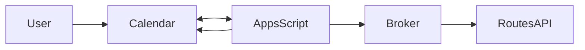
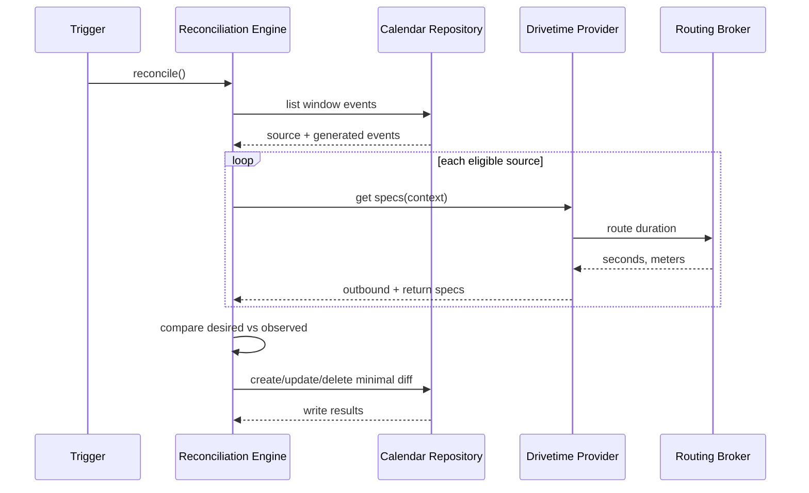
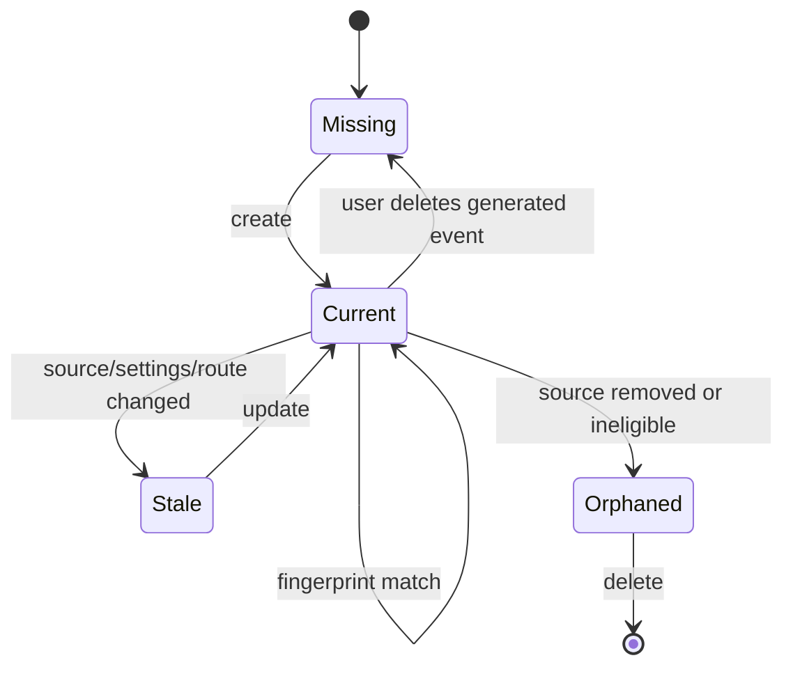
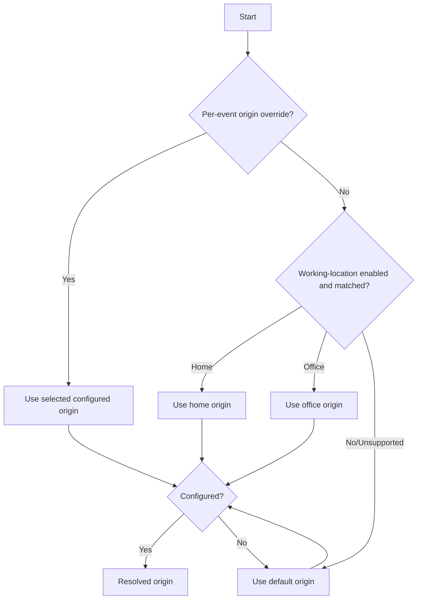

# Architecture Diagrams

## Component diagram

```mermaid
flowchart LR
    User --> Calendar
    Calendar <--> AppsScript
    AppsScript --> Broker
    Broker --> RoutesAPI
    AppsScript --> Calendar
```

## Reconciliation sequence

```mermaid
sequenceDiagram
    participant Trigger
    participant Engine as Reconciliation Engine
    participant Calendar as Calendar Repository
    participant Provider as Drivetime Provider
    participant Broker as Routing Broker

    Trigger->>Engine: reconcile()
    Engine->>Calendar: list window events
    Calendar-->>Engine: source + generated events
    loop each eligible source
        Engine->>Provider: get specs(context)
        Provider->>Broker: route duration
        Broker-->>Provider: seconds, meters
        Provider-->>Engine: outbound + return specs
    end
    Engine->>Engine: compare desired vs observed
    Engine->>Calendar: create/update/delete minimal diff
    Calendar-->>Engine: write results
```

## Generated-event lifecycle

```mermaid
stateDiagram-v2
    [*] --> Missing
    Missing --> Current: create
    Current --> Current: fingerprint match
    Current --> Stale: source/settings/route changed
    Stale --> Current: update
    Current --> Orphaned: source removed or ineligible
    Orphaned --> [*]: delete
    Current --> Missing: user deletes generated event
```

## Origin resolution

```mermaid
flowchart TD
    Start --> Override{Per-event origin override?}
    Override -- Yes --> Selected[Use selected configured origin]
    Override -- No --> Working{Working-location enabled and matched?}
    Working -- Home --> Home[Use home origin]
    Working -- Office --> Office[Use office origin]
    Working -- No/Unsupported --> Default[Use default origin]
    Home --> Validate
    Office --> Validate
    Selected --> Validate
    Default --> Validate
    Validate{Configured?}
    Validate -- Yes --> Done[Resolved origin]
    Validate -- No --> Default
```
